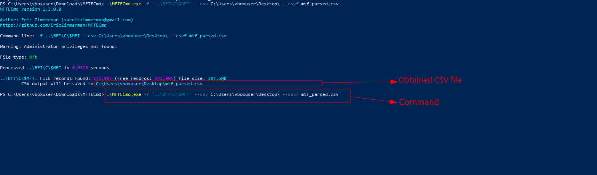
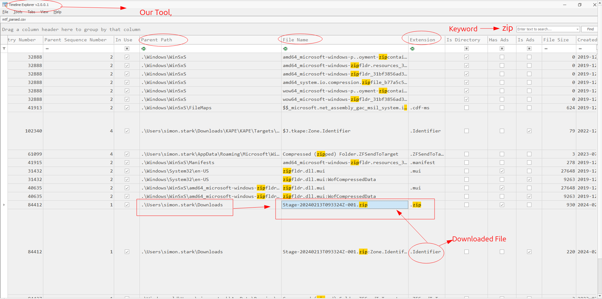
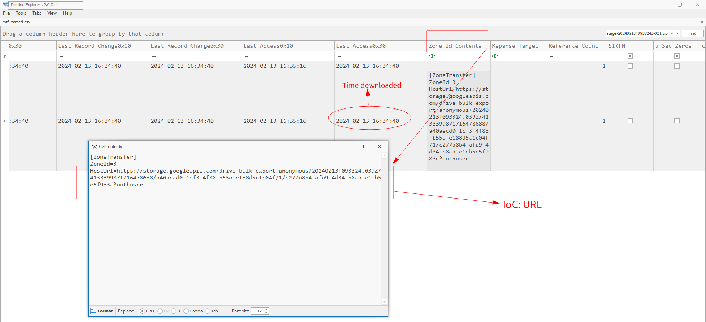
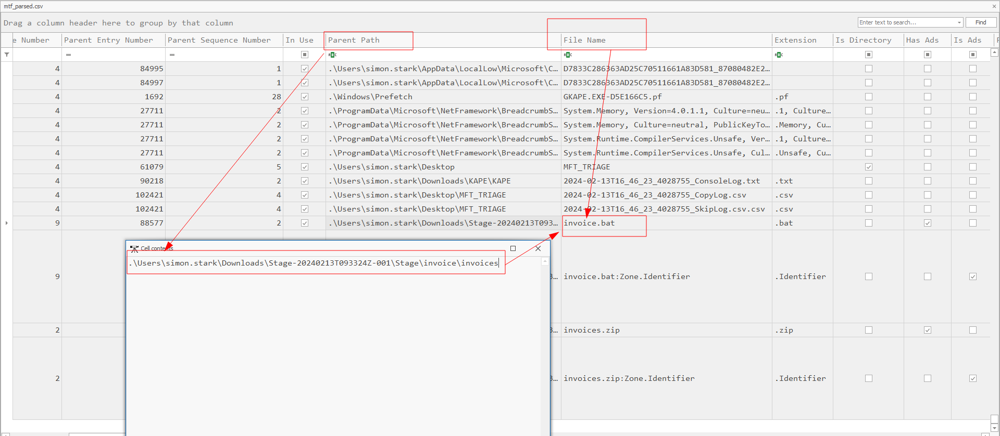
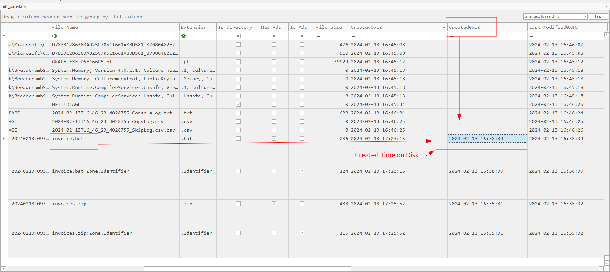
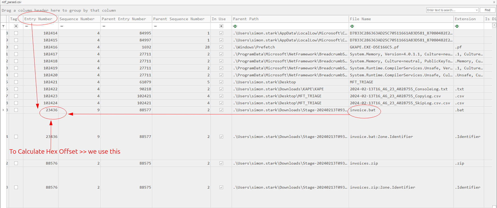
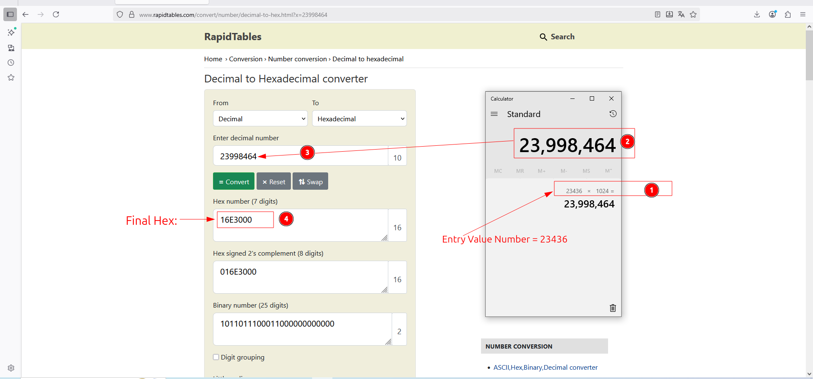
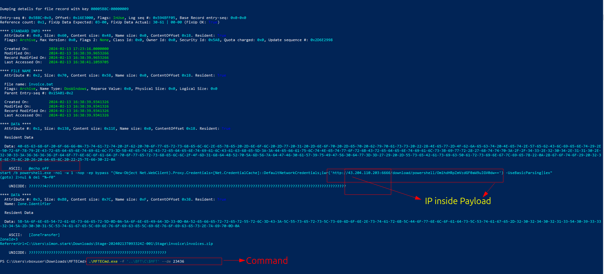

# Sherlock / SOC / CTI / DFIR / IR Exercice

## Title: BFT

## Date: 06/10/2025

## Objective:
Le but de cette exercice est de travailler avec **MFT** forensics et analyser son contenu pour identifier ses artifacts et les actions malveillants.

## Environment / Tools Used:
* HTB Sherlocks:
* **MFTECmd** -> pour parser le fichier: **MFT**
* **Timeline Explorer** -> pour ouvrir et analyser les résultats du fichier parsé
* **Hex Editor** -> récupérer les contenus du fichier, **MFT**.

## Investigation Steps:
1. Analyser les iinformations disponiblees dans **$MFT** et faire **parsing** par l'outil: **MFTECmd.exe**
2. Trouver les informations avec l'outil **Timeline Explorer**
3. Utiliser **MFTECmd.exe** avec l'option dumping: `--de <entry number>`

## Findings:
1. On a une information que l'utilisateur: `Simon Stark` a téléchargé le fichier `zip`. Maintenant, on doit trouver ce fichier en utilisant le fichier `$MFT`
    - D'abord, pour parser ce fichier, `$MFT`, je dois utiliser l'outil: **MFTECmd** par Eric Zimmerman:
    - J'ai téléchargé l'outil dans le systeme Windows et ai exécuté cette commande:
        - `.\MFTECmd.exe -f '..\BFT\C\$MFT' --csv C:\Users\vboxuser\Desktop\ --csvf mtf_parsed.csv`
    

    - Après, pour ouvrir le fichier csv: `mtf_parsed.csv`, j'ai utilisé l'outil: **Timeline Explorer** par Eric Zimmerman
    - J'ai utilisé le mot clé: `zip` pour rechercher le fichier.
    - Donc, j'ai trouvé `Identifier` qui montré le fichier téléchargé de `Browsers`
    - Voilà, la preuve: le fichier:`Stage-20240213T093324Z-001.zip` a été téléchargé par l'utilisateur: `Simon Stark`
    

2. En utilisant le propriété: **Identifier**, on doit trouver l'URL laquel l'utilisateur a téléchargé.
    - Pour trouver cette information, je continue d'utiliser **Timeline Explorer**
    - J'ai trouvé l'information:
    ```code
        https://storage.googleapis.com/drive-bulk-export-anonymous/20240213T093324.039Z/4133399871716478688/a40aecd0-1cf3-4f88-b55a-e188d5c1c04f/1/c277a8b4-afa9-4d34-b8ca-e1eb5e5f983c?authuser
    ```
    - Pour les autres, ce IoC serai très utile; j'espère:)
    - Voilà, la preuve:
    

3. On doit trouver le chemin complet du fichier malveillant:
    - Ma méthode d'enquêter est faire une connexion entre les temps dans l'outil **Timeline Explorer**:
    - Je connaîs quand le fichier zip a été téléchargé: `2024-02-13 16:34:40`
    - J'ai recherché les événements après ce temps.
    - J'ai trouvé qu'il y a un fichier: `invoice.bat` et c'est `batch file` dans le systeme Windows
    - Voilà la preuve:
    

4. Maintenant, on doit aussi trouver la date crée de ce fichier malveillant:
    - Avec la propriété: `$Created0x30`
    - J'ai utilisé l'outil: `Timeline Explorer` et trouvé la date crée: `2024-02-13 16:38:39`
    - Voilà la preuve:
    

5. Pour stocker les données: on doit trouver **Hex Offset** de ce fichier: `invoice.bat`
    - Pour calculer `Hex Offset` >> d'abbord on trouve le **Entry Number** de l'outil `Timeline Explorer`
    - La formule: Entry Number * 1024 = Valeur Décimale (il faut convertir à l'Hex
    - J'ai fait cela et obtenu l'Hex Offset: `16E3000`
    - Voilà les preuves:
    
    

6. On connaît quand la taille du fichier est moins que `1024 bytes`, **$MFT** peut inclurer cela. Et
   on doit trouver l'**IP addresse**.
    - Donc, on essai de trouver le contenu de ce fichier
    - J'ai utilisé cette commande: `.\MFTECmd.exe -f '..\BFT\C\$MFT' --de 23436`
    - Ici: `--de` pour faire **dumping** et extracter la partie avec le numero: `23436` de **$MFT**
    - Après, on a trouvé les informations dans la section: *DATA*
    - IP Addresse: `43.204.110.203:6666`
    - Voilà la preuve:
    

## Key Learning / Takeaway:
1. Si la taille du fichier est moins que 1024 bytes, $MFT peut stocker son contenu:
2. L'outil: `MFTECmd.exe --de <entry number>` >> c'est génial de savoir.

## Voilà:
- **Voilà,( ça y est, c'est fini:** `https://labs.hackthebox.com/achievement/sherlock/2118023/633`
