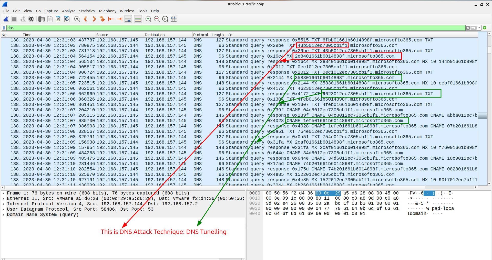
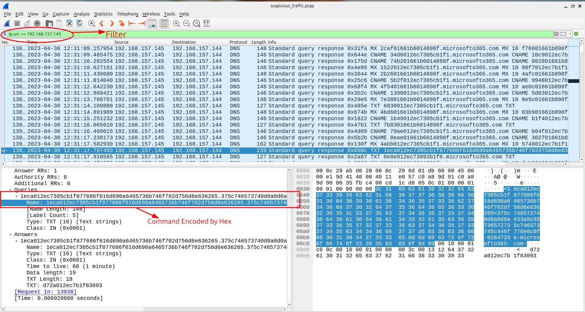
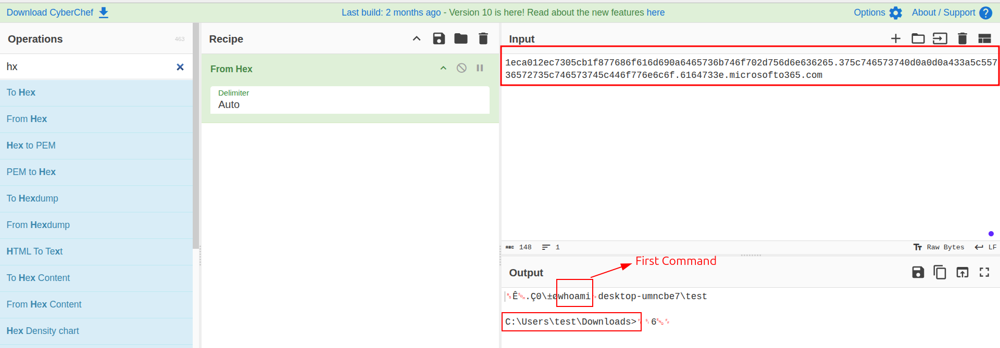
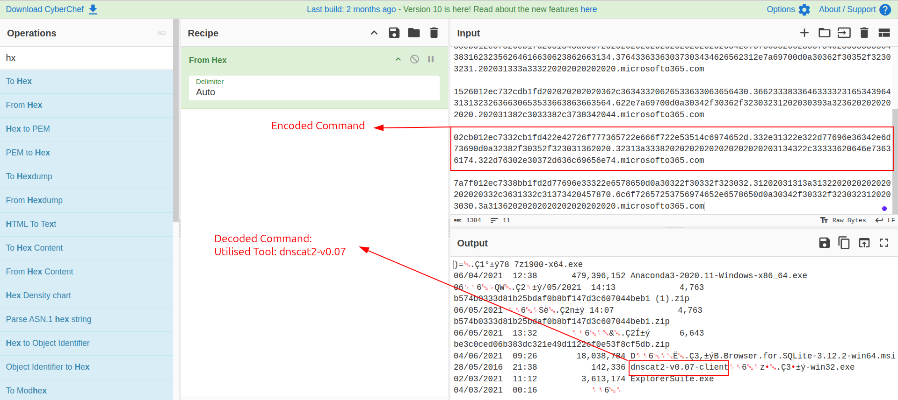
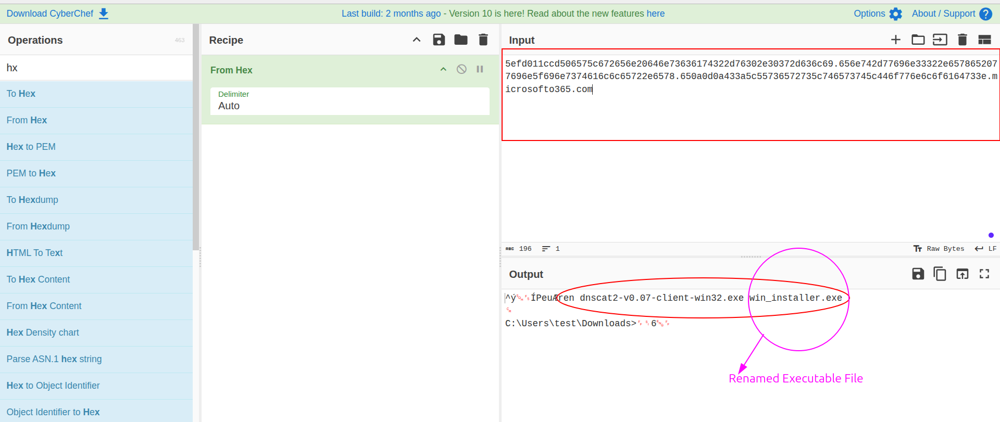
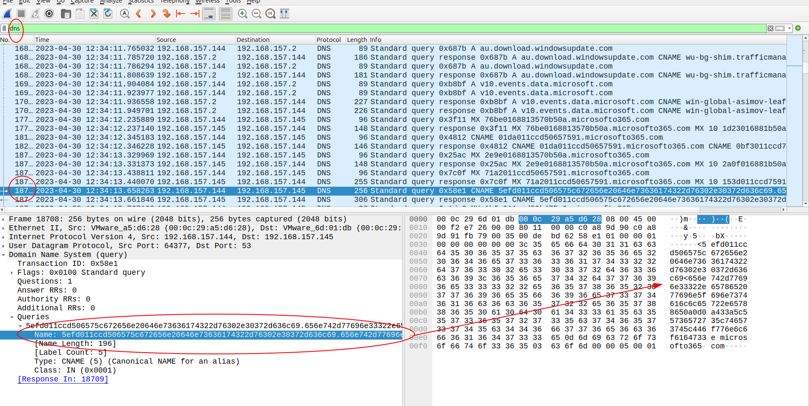
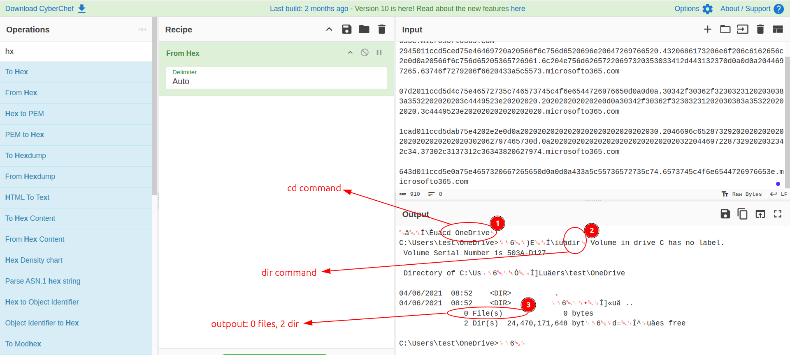
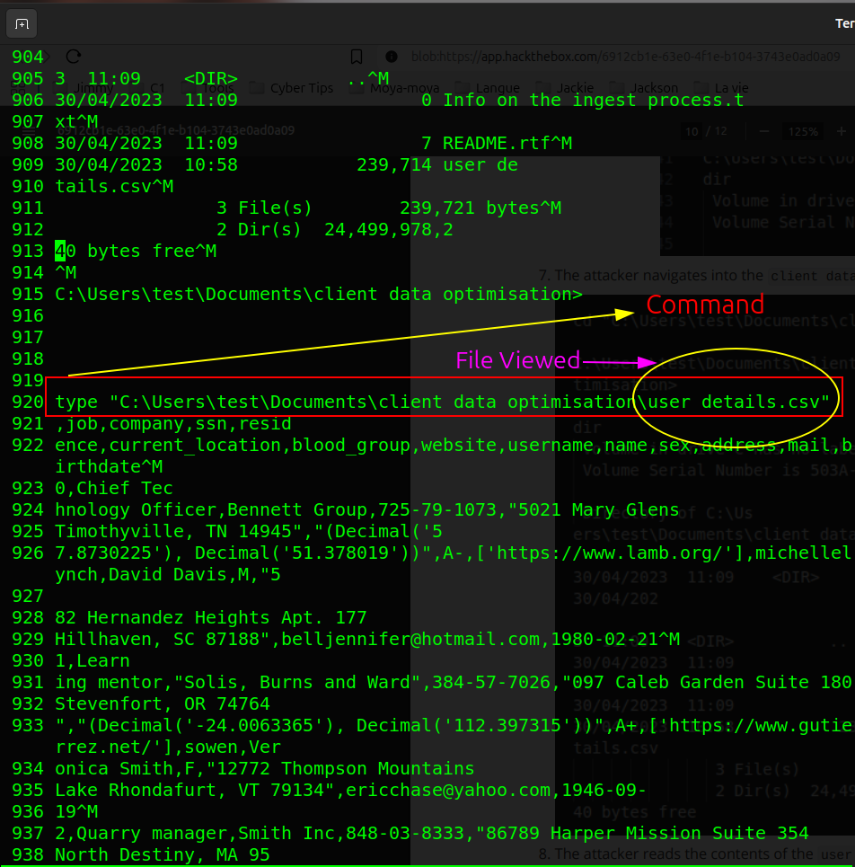
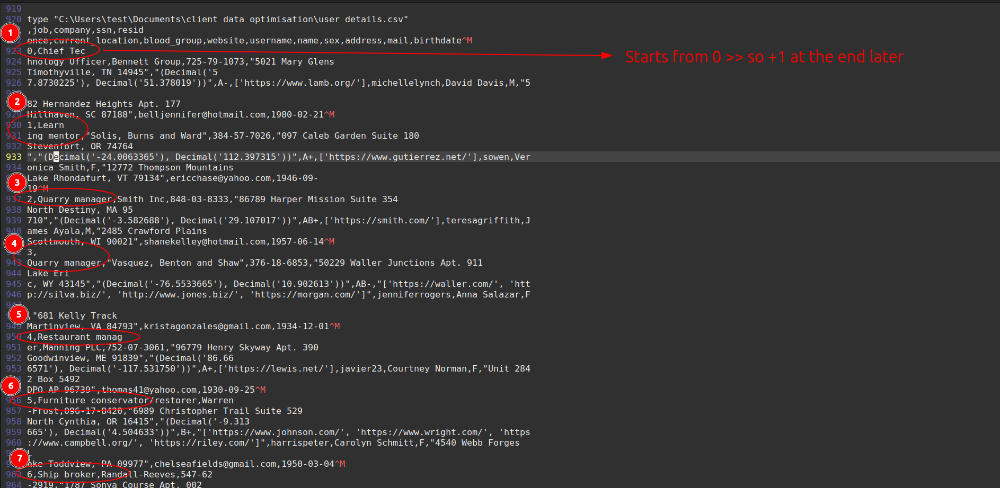
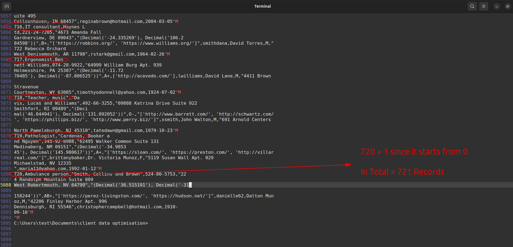

# Sherlock / SOC / CTI / DFIR / IR Exercice

## Title: Litter

## Date: 17/10/2025

## Objective:
Le but de la chasse est identifier la source d’un accès non autorisé par quelque groupe, et analyser leur actions malveillants dans le systeme de test.

## Environment / Tools Used:
* HTB Sherlocks: DFIR, SOC
* Wireshark, grep, python

## Investigation Steps:
1. Analyser les informations disponiblees avec le fichier: `suspicious_traffic.pcap`
2. Trouver les informations par le `Wireshark`, `grep`,
3. Finaliser et analyser les données exfiltrées.

## Findings:
1. On doit trouver quel protocol parait suspect
    - Quand j'ai analysé la source: le fichier donné: `PCAP` par l'outil: **Wireshark**, j'ai trouvé qu'il y a beacoup de requêt avec `DNS`
    - Mais ils semblent pas bon car il a des données supplementairees:
        - `2adee2392ewew93.microsoftto365.com`
    - On connaît que cette technique, `ajouter les données cryptées` s'apple **DNS Tunelling**
    - Voilà, l'attaque est associé avec le protocol: *DNS*
    

2. On doit trouver l'IP addresse de l'attaquant
    - Pour trouver cette information, on connaît son protocol utilisé: *DNS*
    - Donc, quand on a verifié le colonne: **Conversations** dans Wireshark, on a trouvé trois connexions et parmi eux, le plus grand nombre de paquets était (10,192) avec l'IP:  `192.168.157.145`
    - C'était l'IP de l'attaquant.
    - Voilà: la preuve:
    
    

3. On doit trouver la première commande dont l'attaquant a utilisé:
    - Pour trouver cette information, on doit enquêter chaque paquet pour trouver le longue string
    - Car le string est crypté par **HEX**, on doit decrypter en utilisent les outils.
    - Par exemple, quand on a analysé ce string crypté:
        ```hex
            1eca012ec7305cb1f877686f616d690a6465736b746f702d756d6e636265.375c746573740d0a0d0a433a5c55736572735c746573745c446f776e6c6f.6164733e.microsofto365.com
        ```
        - il nous a donné:
        ```bash
            ␞Ê␁.Ç0\±øwhoami
            desktop-umncbe7\test
            C:\Users\test\Downloads>␌␏6␅␌
        ```
    - Voilà, on a trouvé que le première commande: **whoami**
    
    

4. On doit trouver le numero de version d'outil utilisé par l'attaquant
    - On a collecté plusiers commandes cryptées que l'attaquant a utilisé
    - Après, on a decrypté par le `CyberChef` et a trouvé que l'outil utilisé par l'attaquant pour **DNS Tunelling** était **dnscat2-v0.07-client**
    - Voilà, la preuve:
    

5. On doit trouver le nouveau nom d'outil modifié par l'attaquant
    - Quand on a continué analyser les commandes utilisé par l'attaquant, on a trouvé que ce string crypté (montré ci-dessous)
    - Le nouveau nom de ce fichier est `win_installer.exe`
    - Voilà, la preuve:
    
    

6. On doit trouver le nombre de fichiers trouvé par l'attaquant dans le **Cloud**
    - Quand on a continué analyser les commandes utilisé par l'attaquant, on a trouvé que ce string crypté (montré ci-dessous)
    - L'attaquant a utilisé ces commandes: `cd \OneDrive` et `dir`
    - Heureusement or Malheuresement, le nombre de fichiers est `0`.
    - Voilà, la preuve:
    

7. On doit trouver le fichier accès par l'attaquant
    - Franchement, le fichier est très grand et donc on doit utiliser `script` pour rechercher les infos
    - En utilisent le Google, j'ai trouvé le script pour extraire les données
    - Voilà: le Python script:
    ```python
from scapy.all import *
def is_hex(s):
    # Hex Value Checker
    try:
        int(s, 16)
        return True
    except ValueError:
        return False
r = rdpcap('suspicious_traffic.pcap')
with open("output.txt", "w") as myfile:
    c = b""
    for packet in r:
    writes to or use live tshark method
    if packet.haslayer(DNSQR):
            a = packet[DNSQR].qname
            no9 = a[18:]
            b = no9.replace(b'microsofto365.com.', b'')
            if not b or b == c:
                continue
            c = b
            try:
                hex_chars = ''.join(ch for ch in b.decode(errors='ignore') if ch in '0123456789abcdefABCDEF')
                ascii_str = bytes.fromhex(
import csv
import re

count = 0
pattern = re.compile(r'\d{4}-\d{2}-\d{2}')

with open("output.txt", newline='', encoding='utf-8', errors='ignore') as f:
    reader = csv.reader(f)
    for row in reader:
        for field in row:
            if pattern.search(field):
                count += 1

print(count)
).decode('utf-8', errors='ignore')
                myfile.write(ascii_str + '\n')
            except ValueError as e:
                print(f"Error converting hex to ASCII: {e}")
    ```
    - Et, j'ai trouvé que l'attaquant a lu le fichier: **user details.csv** dans cette location: `"C:\Users\test\Documents\client data optimisation\user details.csv"`
    - Voilà, la preuve:
    

8. On doit trouver le nombre total de données exfiltrées par l'attaquant
    - Quand on a analysé le contenu du fichier:`user details.csv`, on a trouvé que le premier colonne est nombre de l'utilisateur.
    - Donc, il peut nous donner le nombre total de l'utilisateur dans ce fichier.
    - On a trouvé que le nombre a commencé de `0` et le dernier nombre est `720`
    - Et ça fait le nombre total = `720 + 1 = 721`
    - Voilà: la preuve
    
    

## Key Learning / Takeaway:
- DNS Tunelling attaque
## Voilà:
- **Voilà, ça y est, c'est fini:** `https://labs.hackthebox.com/achievement/sherlock/2118023/555`
