# Sherlock / SOC / CTI / DFIR / IR Exercice

## Title: LogJammer

## Date: 21/10/2025

## Objective:
Le but de cet exercice et chasse est d'identifier la source d’un accès non autorisé par l'utilisateur: **CyberJunkie** et d'analyser ses actions malveillants en utilisent les événements de Windows.

## Environment / Tools Used:
* HTB Sherlocks: SOC, DFIR
* Windows Event Viewer, Chainsaw, Google Search, Windows Event ID List

## Investigation Steps:
1. Analyser les informations disponiblees: **Windows Logs: Security, System, Powershell, Defender**
2. Trouver les informations avec les **Windows Event IDs** certaines:
3. Utiliser l'outil: *Windows Event Viewer* et *Chainsaw*

## Findings:
1. On doit trouver quand l'utilisateur: Cyberjunkie a fait le premier login dans son système
    - Pour trouver cette information, on doit analyser la source donné: **Event-Logs**
    - J'ai utilisé l'outil: **Event Viewer** dans Windows et a filtré par **XML** comme:
    ```xml
        *[System[(EventID=4624)]]
	    and
	    *[EventData[Data[@Name='TargetUserName'] and (Data='CyberJunkie')]]
    ```

    - Et les résultats sont quatre événements: Le premier événement a ete à `03/27/2023 14:37:09`
    - Voilà, la preuve:
    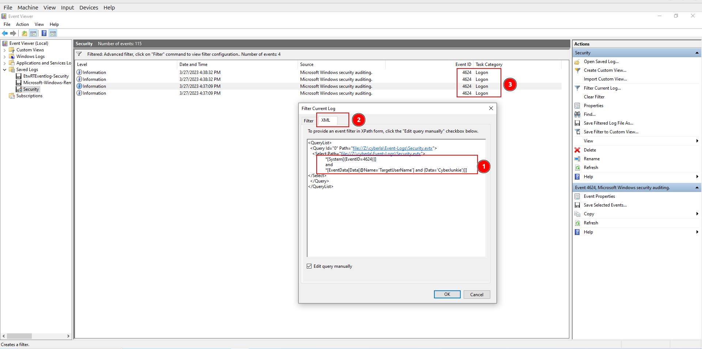
    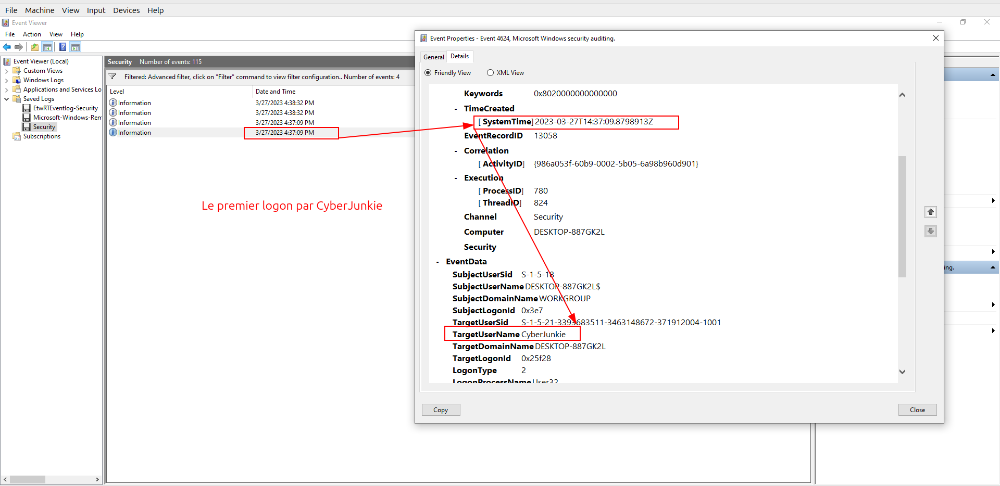

2. Maintenant, on doit trouver le nom de la règle que l'attaquant a crée
    - La source: `Firewall Logs`
    - Pour trouver cette information, on connaît le SID de l'utilisateur: CyberJunkie: `S-1-5-21-3393683511-3463148672-371912004-1001`
    - Donc, j'ai utilisé l'outil: **chainsaw** pour trouver les événements qui sont associés avec ce SID
    - Et puis, j'ai recherché le `RuleName` >> c'est ma méthode d'enquêt.
    - C'est bizzare d'avoir ce **RuleName**: **Metasploit C2 Bypass**
    - Voilà, la preuve:
    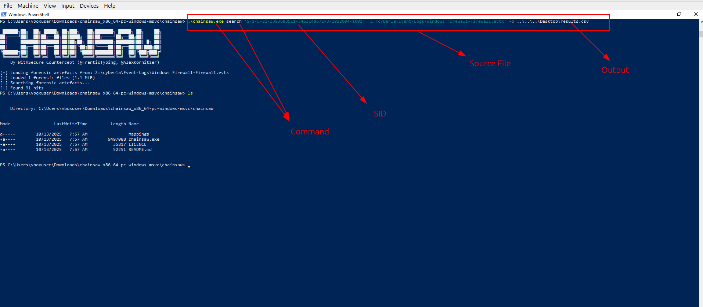
    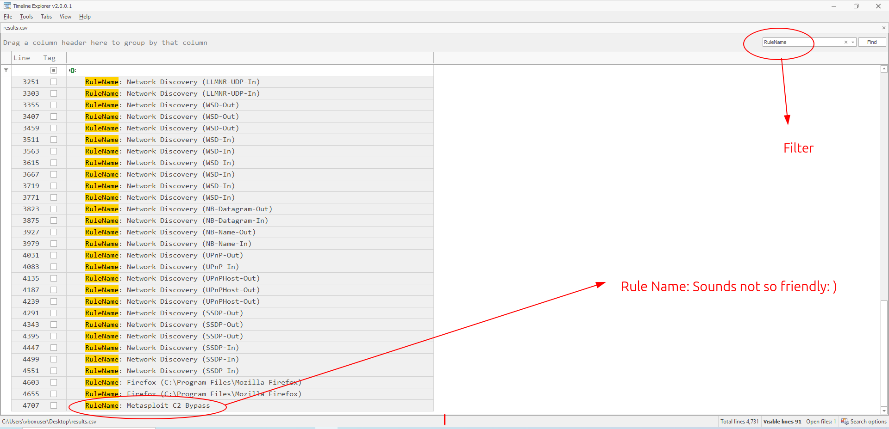

3. On doit trouve la direction de cette règle
    - Quand on a analysé l'événement ID: `2004` avec le mot clé: `Bypass`
    - On a trouvé ce qu'on a cherché.
    - La direction est **Outbound**
    - Voilà, la preuve:
    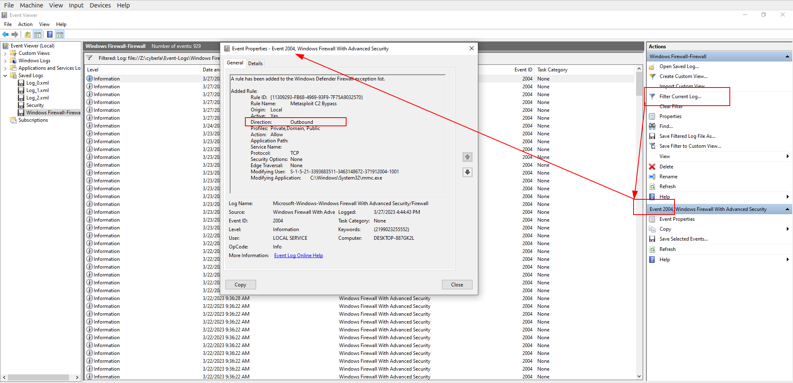

4. On doit trouver le *Sub-category* de *Audit Policy*
    - Pour trouver les événements de **Audit Policy Change**, on doit utiliser l'ID: **4719** qui montre cet événement
    - Quand on a recherché cet ID, on a trouvé un seul événement
    - Et sub-category: **Other Object Access Events**
    - Ça veut dire que l'attaquant peut accèder les autres objets dans le système maintenant
    - Voilà, la preuve:
    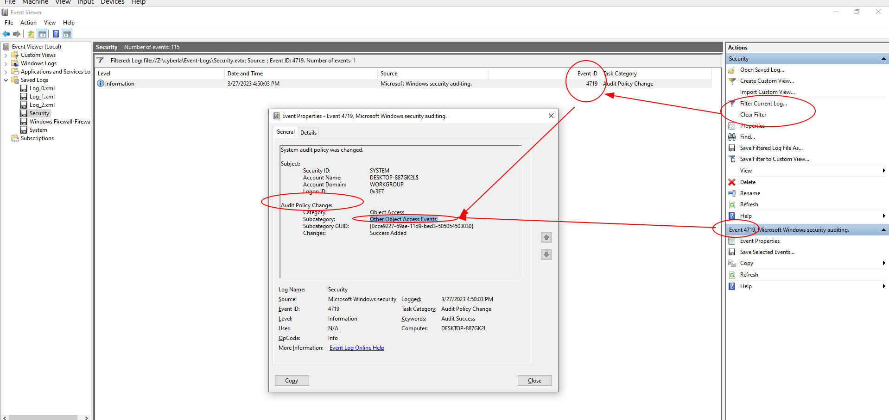

5. On doit trouver le nom de la tâche planifiée.
    - Pour trouver cette info, on connaît que l'ID: **4698** indique cela.
    - Quand on a analysé la source, on a trouvé ce qu'on a cherché
    - La réponse est: `HTB-AUTOMATION`
    - Voilà, la preuve:
    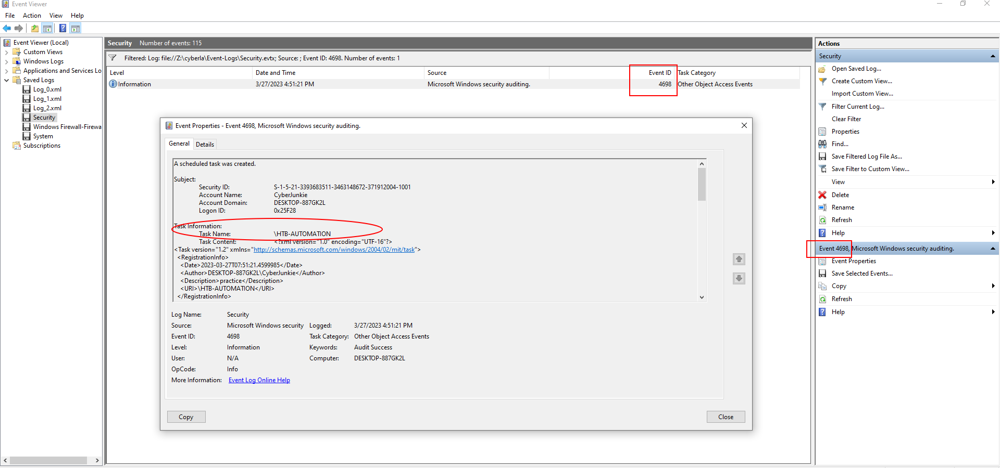

6. Après cinqième question, on doit trouver le chemin de fichier:
    - Quand on a analysé le même événement, on a trouvé l'info nécessairee
        - `C:\Users\CyberJunkie\Desktop\Automation-HTB.ps1`
    - Voilà, la preuve:
    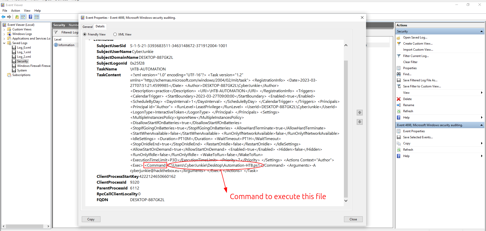

7. On doit trouvé l'argument utilisé par l'attaquant:
    - Quand on a analysé le même événement, on a trouvé l'info nécessairee
        - `-A cyberjunkie@hackthebox.eu`
    - Voilà, la preuve:
    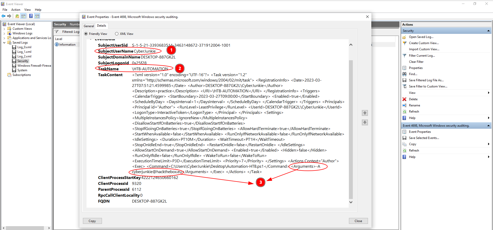

8. On doit trouver un événement: menace trouvé par l'antivirus:
    - Pour trouver cette information, j'ai utilisé la source: `Windows Defender Logs`
    - On connaît que:
        - `ID: 1116` indique: *Malware Detected*
        - `ID: 1117` indique: *Malware Cleared/Quarantined*
        - `ID: 1118` indique: *Malware Removed*
        - `ID: 1119` indique: *Malware action failed*
        - `ID: 5007` indique: *Defender Settings Policy changed*
    - Donc, quand on a recherché l'ID: `1116`, on a trouvé l'événement qui il a un logiciel malveillant
    - Ce logiciel est: `Sharphound`
    - Voilà, la preuve:
    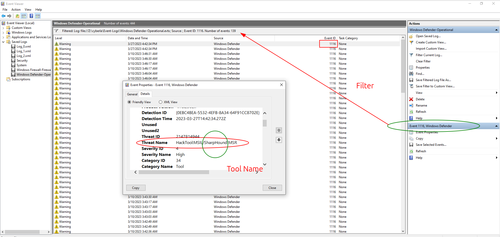

9. Maintenant, on doit trouver le chemin de ce menace:
    - Pour trouver cette info, on a continué analyser cet événement de question#8
    - On a trouvé ce chemin: `C:\Users\CyberJunkie\Downloads\SharpHound-v1.1.0.zip`
    - Voilà, la preuve
    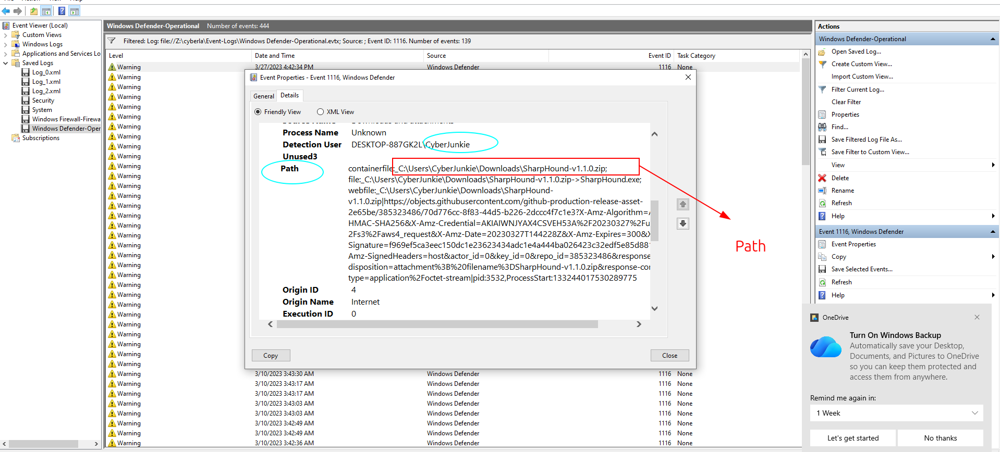

10. On doit trouver quelle action est fait par l'antivirus:
    - Pour trouver cette informtion, on connaît que on doit rechercher l'ID: `1117` qu'indique les événements de **Malware Cleared/Quarantined**
    - On trouvé que cet événement est **quarantiné**. Ça veut dire que l'antivirus a réussi à faire cela
    - Voilà, la preuve:
    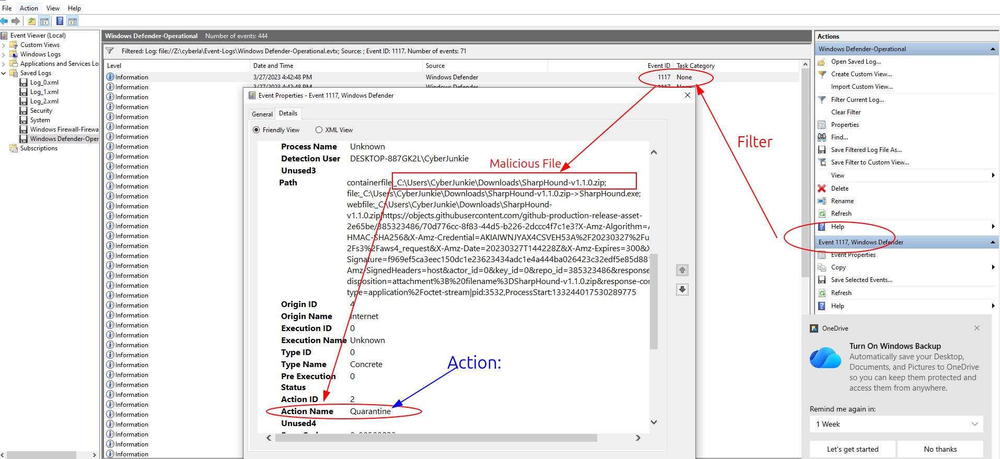

11. On doit trouver qulle commande de PowerShell est utilisé par l'attaquant
    - Pour trouver cette info, on a la source: `Powershell evtx Logs ` et dans ce fichier, on peut enquêter
    - On connaît que l'ID: **4104** peut indiquer les événements quand commande or script de PowerShell est exécuté
    - En consequence, on a trouvé cet événement avec la commande utilisé: `Get-FileHash -Algorithm md5 .\Desktop\Automation-HTB.ps1`
    - Voilà, la preuve:
    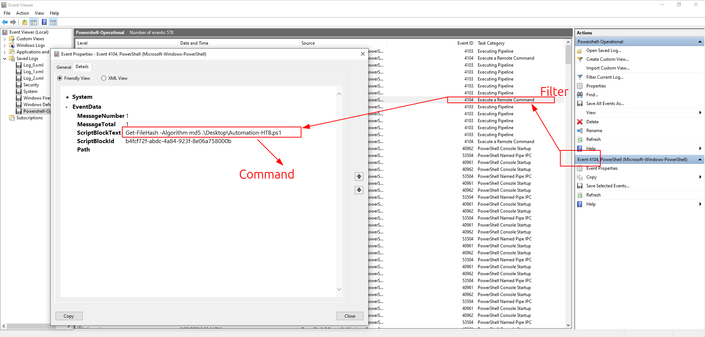

12. Maintenant, on doit trouver quel événement est supprimé par l'attaquant
    - D'abord, on connaît ces IDs:
        - `ID: 1102` indique: *Security Log Cleared*
        - `ID: 104` indique: *Log Cleared*
    - Quand on a analysé la source: `System evtx`, on a recherché l'ID: `104`
    - Puis, on a trouvé: ce fichier: *Microsoft-Windows-Windows Firewall With Advanced Security/Firewall* est supprimé
    - Voilà, la preuve:
    

## Key Learning / Takeaway:
1. Les événements de Firewall: `2004` (règle ajoutée), `2005` (règle modifiée et `2006` (règle supprimée)
2. L'événement ID `4719` montre: `Audit Policy Change`
3. Les ID de l'Antivirus: `1116`, `1117`, `1118`, `1119`, `5007`
4. PowerShell Script, Commande est exécuté: `4104`
5. System: **Log Cleared:**: `104`, `1102`

## Voilà:
- **Voilà, ça y est, c'est fini:**
