# Sherlock / SOC / CTI / DFIR / IR Exercice

## Title: Nubilum2

## Date: 23/10/2025

## Objective:
Le but de cet exercice et cette chasse est d'identifier les problems avec **AWC S3 Bucket** et **CloudTrail Logs** et la vulnerabilité, la source d’un accès non autorisé et d'analyser les actions malveillants.

## Environment / Tools Used:
* HTB Sherlocks:
* AWS S3 Buckets, CloudTrail Logs
* Cloud Sécurité

## Investigation Steps:
1. Analyser les informations disponiblees dans **AWS S3 Bucket CloudTrail**: `json fichiers`
2. Convertir les **json fichiers** au `flattened.json` unique pour le **Splunk analyse** par **le script Python**
3. Installer le **Splunk** et controller par le **terminal**
4. Analyser les informations par l'outil de SIEM: Splunk
5. Utiliser **Splunk Processing Language: SPL**

## Findings:
1. On doit trouver l'IP address de l'attaquant:
    - Pour trouver cette information, d'abord, on doit connaître ce que on a dans les bras
    - On a les logs: json fichiers; et le nom de bucket: *forela-fileshare*
    - Quand on a analysé les logs dans Splunk: on a filtré avec cette commande:
    ```SPL
        index="okay_json" "requestParameters.bucketName"="forela-fileshare"
        | stats count by sourceIPAddress
        | sort - count
    ```
    - Puis, l'IP Address avec le grande nombres de accès est `54.242.59.197`
    - Et Voilà, la preuve:
    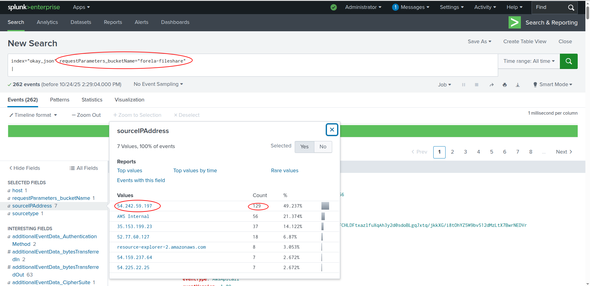
    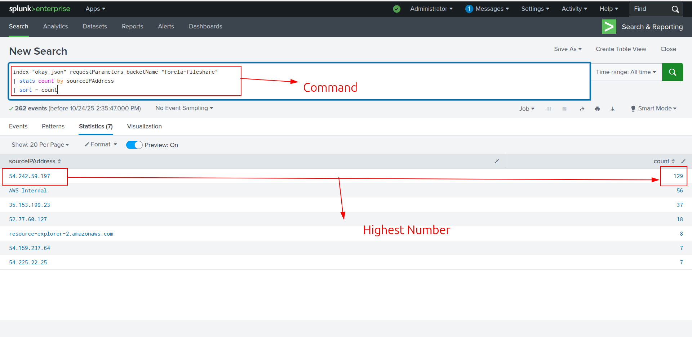

2. On doit trouver le nom, accountID et le temps de premier object que l'attaquant a accèdé!
    - Pour trouver cette information, j'ai utilisé ce filtre:
    ```SPL
        index="okay_json" requestParameters_bucketName="forela-fileshare" sourceIPAddress="54.242.59.197"
        requestParameters_key="_restricted/Priv-Keys/prod-EC2-readonly_accessKeys.csv"
    ```
    - Analyse:
        - `requestParameters_bucketName` pour préciser le nom de bucket: *forela-fileshare*
        - Et j'ai l'IP de l'attaquant, donc, j'ai utilisé cela aussi: `sourceIPAddress = 54.242.59.197`
        - `requestParameters_key` montre le fichier accès, donc je voulais voir quels fichiers l'attaquant a accès
        - Parmi les fichiers, ce fichier est souvent associé avec l'attaquant et donc j'ai vérifié cela.
    - Par consequant, j'ai trouvé ces infos:
        - Le temps accès: `2023-11-02T14:52:03Z,`
        - Le nom du fichier: `prod-EC2-readonly_accessKeys.csv`
        - L'accountID: `anonymous`
    - Voilà,les preuves:
    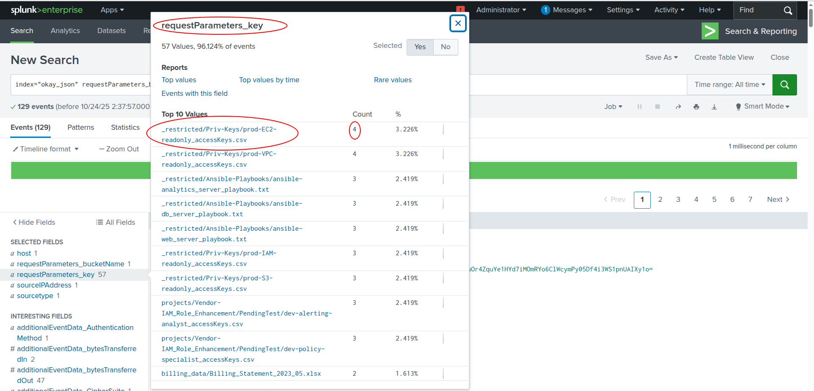
    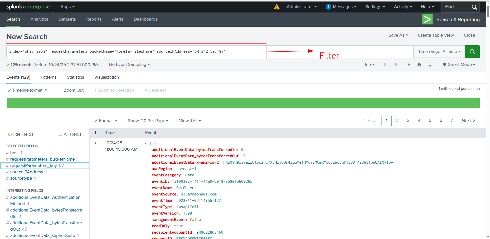
    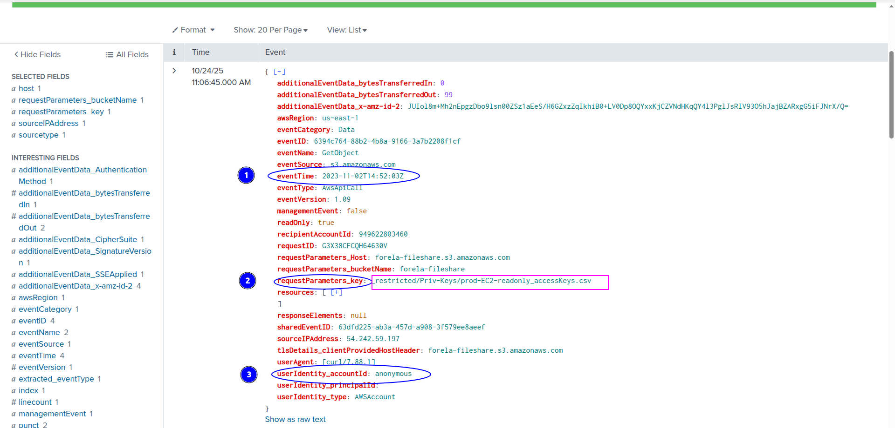

3. On doit trouver combine de *Access Keys* clés sont compromisées par l'attaquant?
    - D'abbord, il faut savoir quel field peut montrer cette info
    - On a trouvé que ce field est correct: `requestParameters_key`
    - On connaît que les fichiers: *accessKeys* sont souvent utilisés pour stocker les clés:
    ```SPL
        index="okay_json"  sourceIPAddress="54.242.59.197" *accessKeys*
        | stats count by requestParameters_key
        | sort - count
    ```
    - Après, on a trouvé que l'attaquant a accès aux sept fichiers qui montre ces 7 fichiers sont compromisés
    - Franchement, c'est la première fois avec **AWS CloudTrail log**, donc, `userIdentity_accessKeyId` est correct mais, `requestParameters_k`est utilisé dans **S3 Bucket** >> cet fonction inclus *bucketName* et*Key*, cette *Key* est *Object Name* et donc, on a recherché le nom de fichiers ici.
    - Voilà, la preuve:
    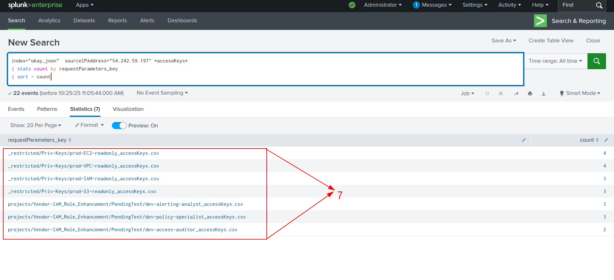

4. On connaît que l'attaquant a exécuté la commande pour trouver les instances de EC2, maintenant, on doit trouver cette commande:
    - **EC2**: *Elastic Compute Cloud* que fournit les serveurs virtuels appelé *instances* pour compute dynamique et scalable
    - Quand on a filtré les événements avec ce filtre:
    ```SPL
        index="okay_json"  sourceIPAddress="54.242.59.197"
        eventSource="ec2.amazonaws.com"
    ```
    - On a trouvé un field: `User Agents` qui est suspect à cause de Kali Linux et commande utilisée
    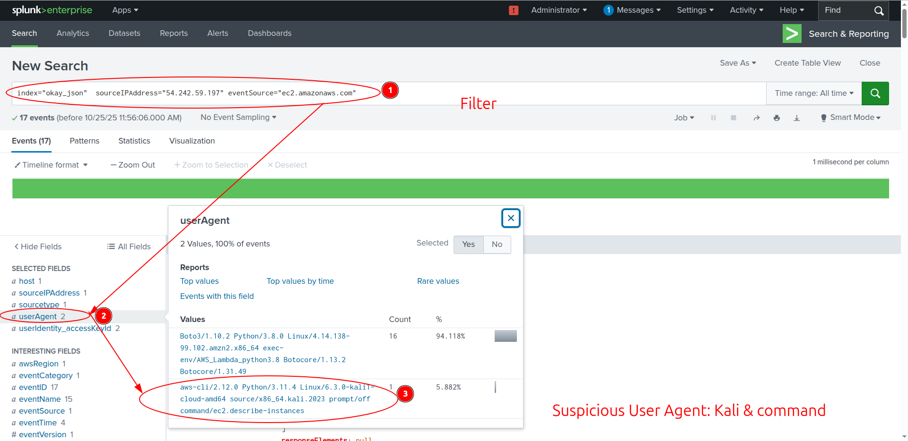

    - Après, on a sélectionné ce *User Agent* et trouvé les données nécessairees: `instance-state-name:running`
    - Voilà, la preuve:
    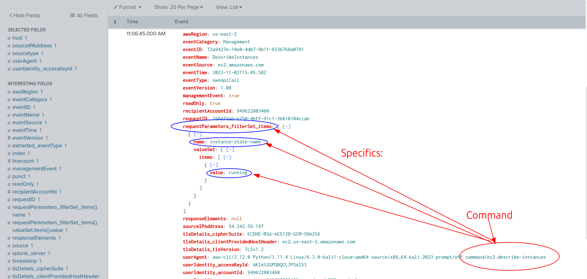

5. Maintenant, on doit trouver le nombre de tentatives infructueuses par l'attaquant.
    - Je connaît que quand le tentative est infructueuse, il fait une erreur, donc, je comprends que je dois vérifier `errorCode` field.
    ```SPL
        index="okay_json"  sourceIPAddress="54.242.59.197"
        errorCode="AccessDenied"
    ```
    - Voilà, j'ai trouvé le nombre de `Access Denied` est `42`
    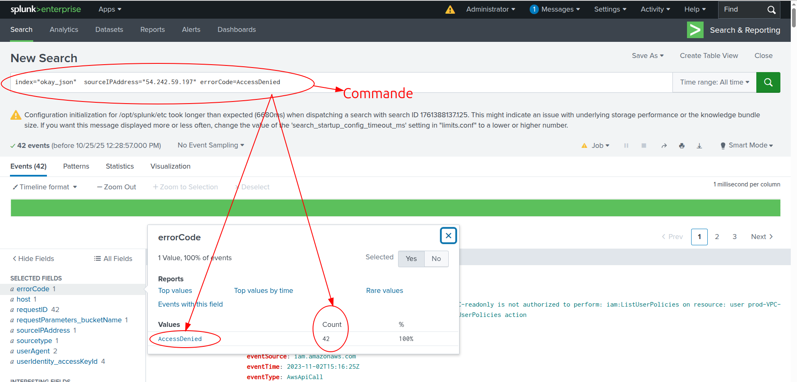

6. On doit trouver quel utilisateur a réussi à faire un login?
    - Pour trouver cette information, j'ai mis le filtre:
    ```SPL
        index="okay_json"  sourceIPAddress="54.242.59.197"
    ```
    - Après, j'ai analysé les `User Agents` et là-bas, j'ai trouvé la commande: `command/iam.list-users`
    - Cette commande n'est pas utilisé par les utilisateurs normals et il faut avoir privilèges élevés.
    - Donc, on peut concluder que l'attaquant en ce moment-là a **privilèges élevés.**
    - Cet utilisateur est **dev-policy-specialist**, dont on a trouvé par `userIdentity_userName`
    - Voilà, la preuve:
    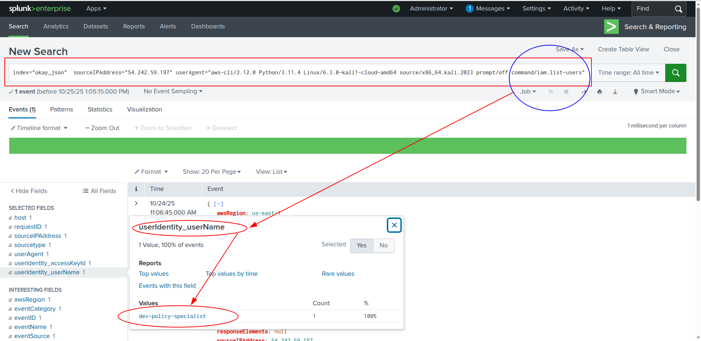

7. On doit trouver le nom de la politique qu'est avec privilèges de l'admin
    - Quand j'ai mis ce filtre:
    ```SPL
        index="okay_json"  sourceIPAddress="54.242.59.197" userIdentity_userName="dev-policy-specialist"
        | rare limit=20 eventName
    ```
    - Parmi les résultats, `PutUserPolicy` nous a attiré:
    ```JSON
        {"Version": "2012-10-17","Statement": [{"Effect": "Allow","Action": "*","Resource": "*"}]}
    ```
    - J'ai compris que l'attaquant a créé la nouvelle politique qui lui permet d'accéder à tous les **ressources: ***.
    - Voilà, la preuve:
    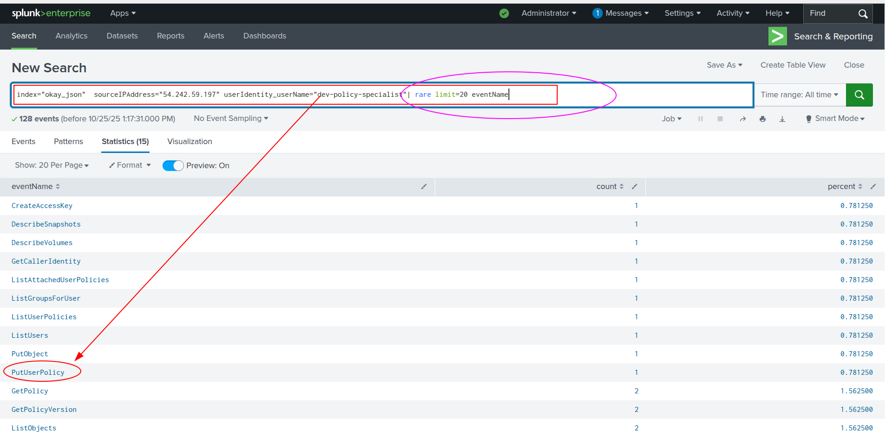
    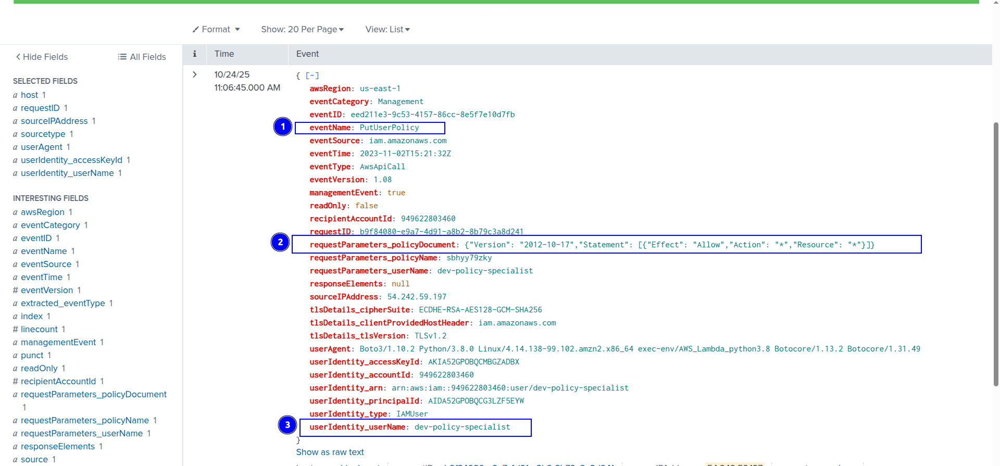

8. Maintenant on doit trouver le nom de cette politique et son contenu:
    - Dans le même événement de la question#7, on peut trouver ces informations:
        - Le nom: `sbhyy79zky`
        - Le contenu: `{"Effect": "Allow","Action": "*","Resource": "*"}`
    - Voilà, la preuve:
    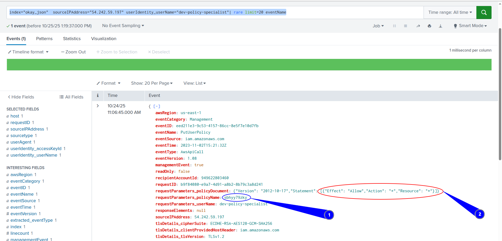

9. On doit trouver le *ARN: Amazon Resource Name* utilisé pour le cryptage
    - Quand on a mis le filtre:
    ```SPL
        index="okay_json"  sourceIPAddress="54.242.59.197" userIdentity_userName="dev-policy-specialist"
    ```
    - Puis, j'ai enquêté les fields, j'ai
        trouvé:`responseElements_x-amz-server-side-encryption-aws-kms-key-id`
    - Ce field montre la info nécessaire: `arn:aws:kms:us-east-1:263954014653:key/mrk-85e24f85d964469cba9e4589335dd0f4`
    - Voilà, la preuve:
    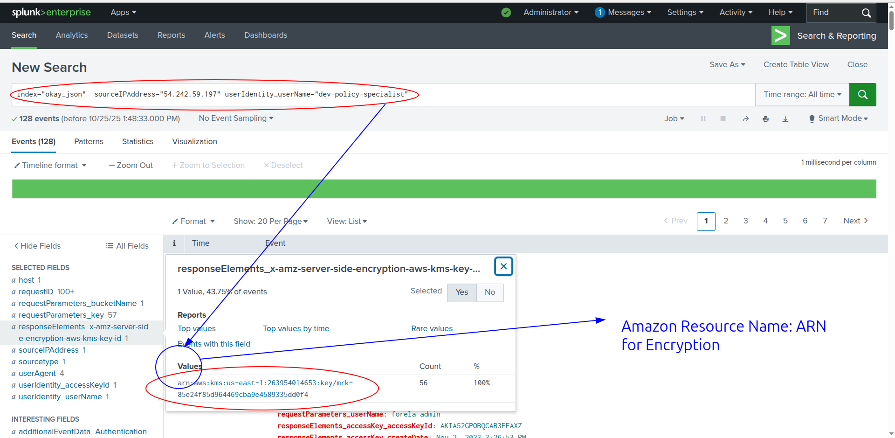

10. On doit trouver quel fichier l'attaquant a téléchargé dans le S3 bucket
    - Pour trouver cela, j'ai utilisé la `eventSource` = `s3.amazonaws`
    ```SPL
        index="okay_json"  sourceIPAddress="54.242.59.197" userIdentity_userName="dev-policy-specialist" eventSource="s3.amazonaws.com"
        | stats count by eventName
    ```
    - Et, on a trouvé: `PutObject` qui est utilisé pour télécharger les fichiers.
    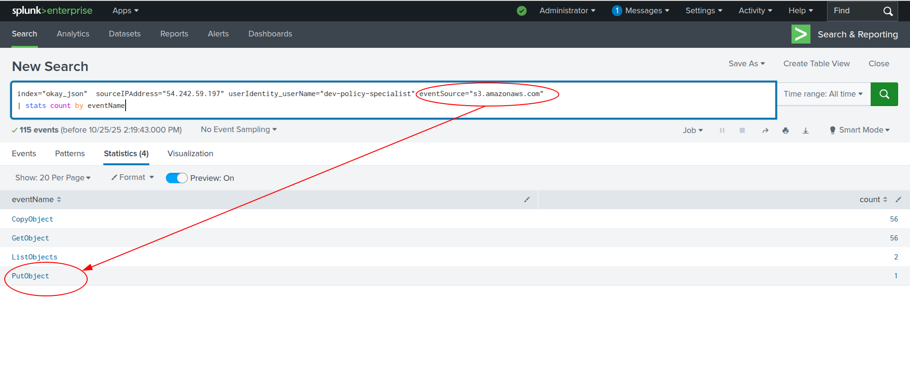
    - Quand j'ai choisi ce `eventName`, j'ai trouvé ce que j'ai recherché:`README2DECRYPT.txt`
    - Voilà, la preuve:
    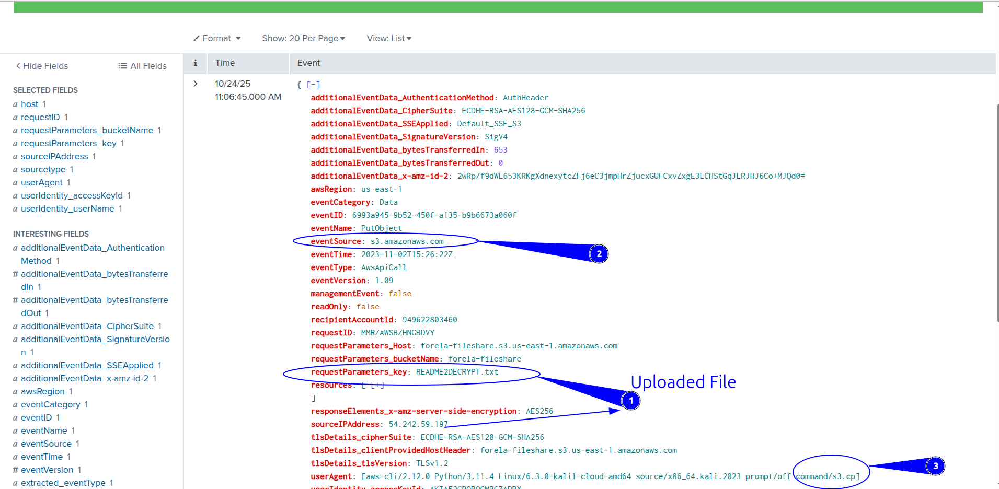

11. On doit trouver lequel *IAMUser* utilisateur l'attaquant a modifié pour préserver accès dans le système.
    - Pour trouver cette info, j'ai utilisé le filtre:
    ```SPL
        index="okay_json"  sourceIPAddress="54.242.59.197" userIdentity_type=IAMUser
    ```
    - Puis, quand on a vérifié `User Agents`, on a trouvé `CreateAccessKey` qui a signalé quelque chose de nouveau.
    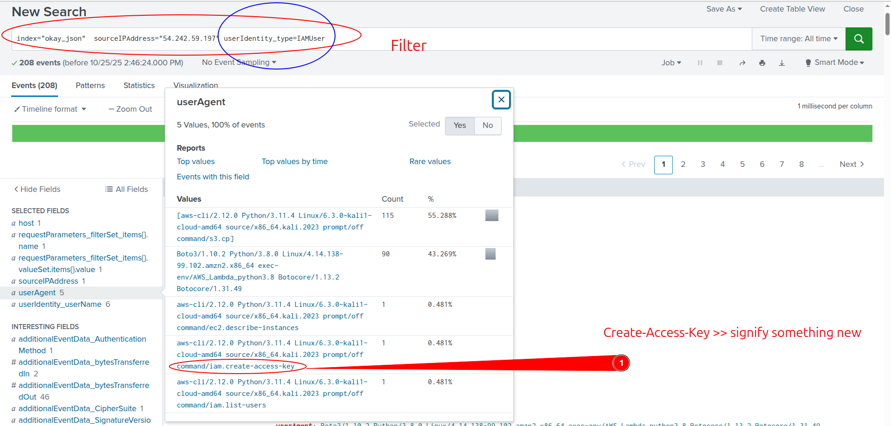

    - Après, on a trouvé que l'attaquant a modifié le compte **forela-admin** par le compte compromisé
    - Voilà, la preuve:
    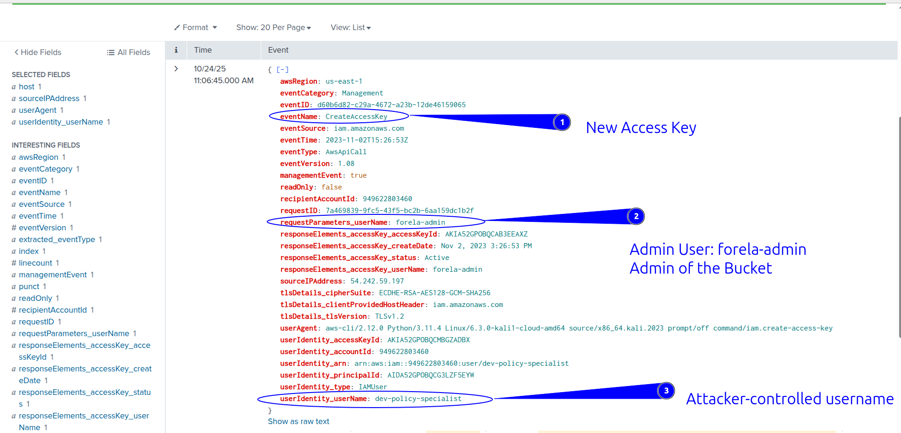

12. On doit trouver une action qui n'est pas autorisé d'accéder et télécharger le fichier pour l'utilisateur de pérformer:
    - D'abord, on a besoin de le field: `errorCode et errorMessage`
    - Après, j'ai compris que il faut utiliser `eventName=GetObject` aussi car l'attaquant peut-être essayer d'accéder au fichier et recevoir cet eterreur
    - Puis, j'ai trouvé que l'action pas autorisé est `kms:Decrypt` pour le fichier: `customer-data.csv`
    - Voilà, la preuve:
    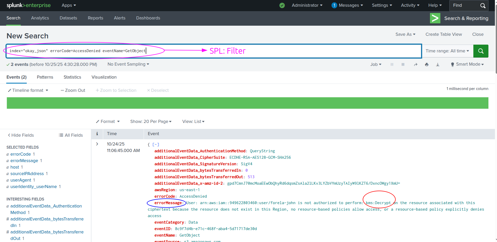
    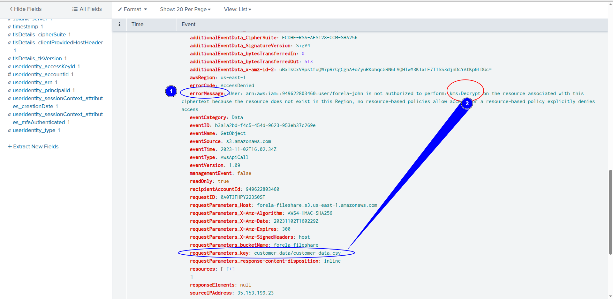

## Key Learning / Takeaway:
- **Log Analyse de AWS S3 Buckets par SIEM: Splunk**
- **CloudTrail Analyse**

## Voilà:
- **Voilà, ça y est, c'est fini:** `https://labs.hackthebox.com/achievement/sherlock/2118023/573`
