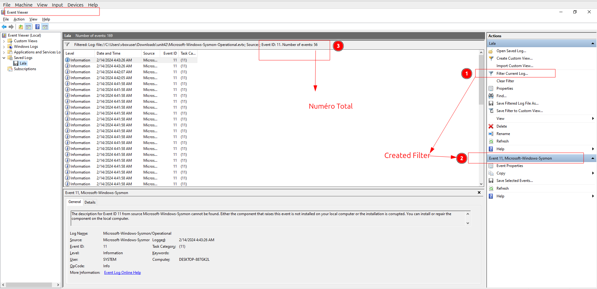
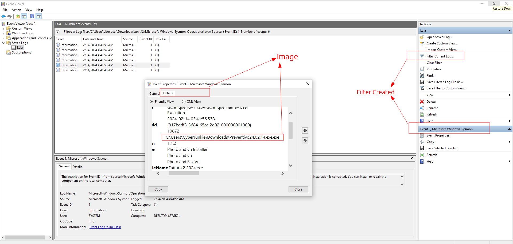
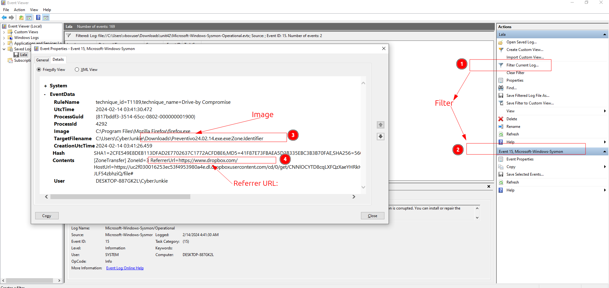
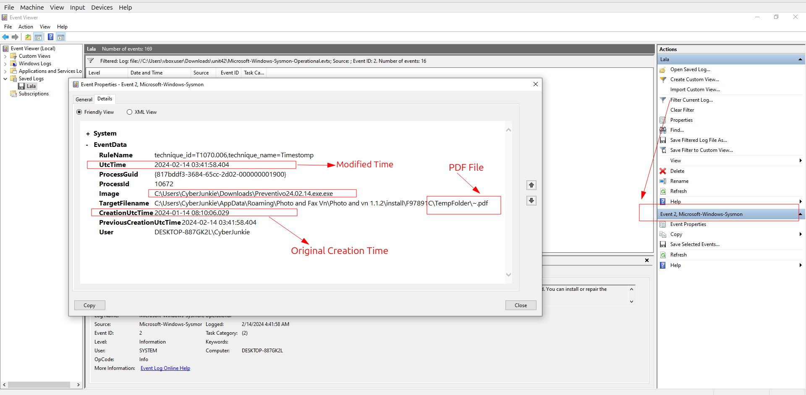
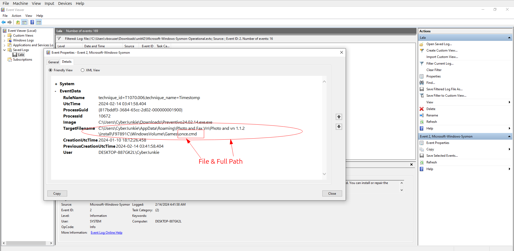
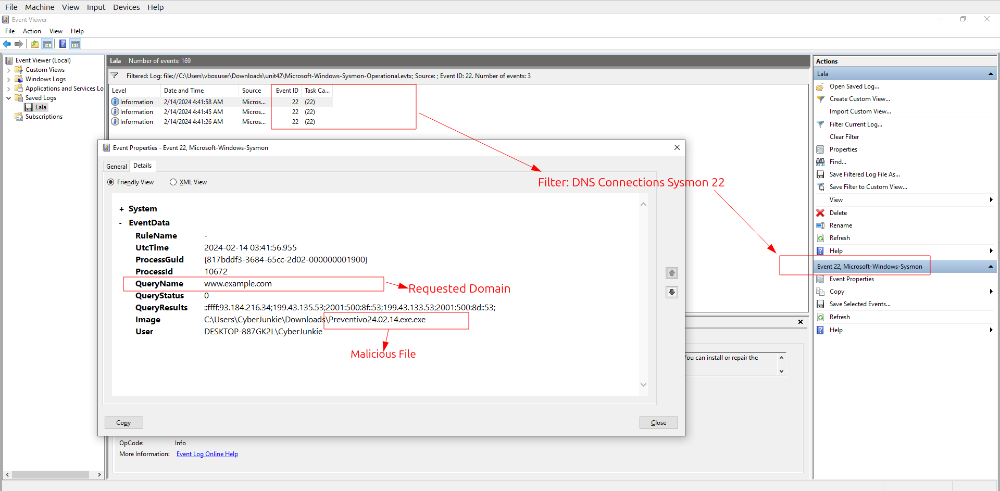
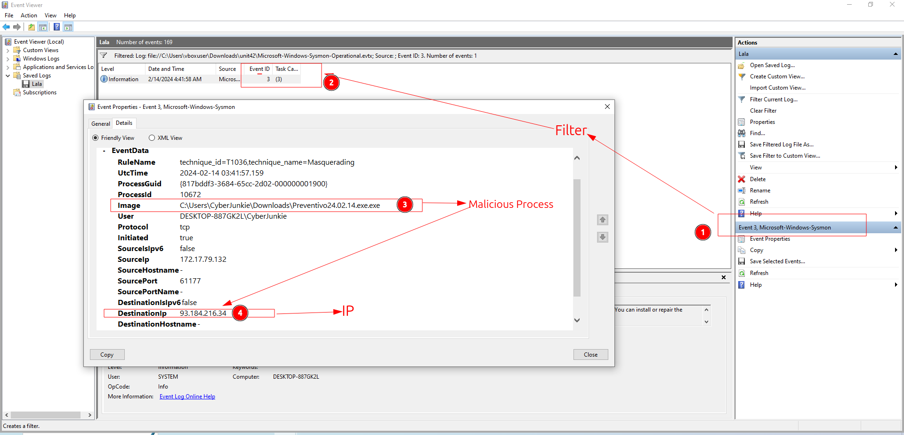
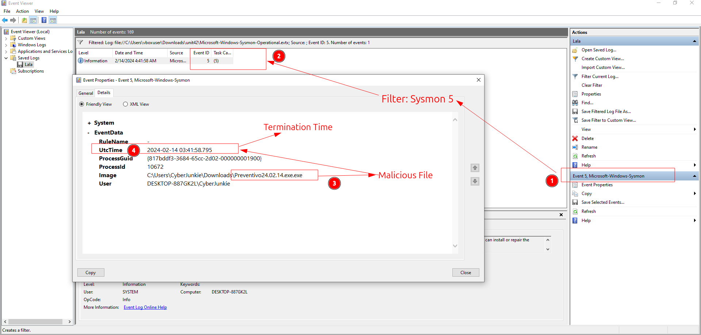

# Sherlock / SOC / CTI / DFIR / IR Exercice

## Title: Unit42

## Date: 07/10/2025

## Objective:
Le but de ce Sherlock est d'identifier les ID événement souvent utilisé **Sysmon** et analyser les actions malveillants. D'ailleurs, il faut apprendre les technique pour **UltraVNC**.

## Environment / Tools Used:
* HTB Sherlocks:
* Event Viewer, Sysmon IDs

## Investigation Steps:
1. Analyser les informationis disponiblees dans le fichier capturé: `Sysmon Logs`
2. Enquêter les informations par **Event Viewer**.
3. Utiliser Sysmon IDs pour trouver les informations exactes.

## Findings:
1. D'abord, on doit trouver combine d'événements sont de **Sysmon 11**
    - On a le fichier *Sysmon log* capturé: Je l'ai ouvert avec l'outil: **Event Viewer**
    - Pour trouver les événements specifiques: j'ai utilisé l'option: `Filter` dans cette application pour ID: `11`
    - J'ai trouvé qu'il y a `56` événements avec **l'ID 11**.
    - Voilà, la preuve:
    

2. On connaît que **l'ID Sysmon 1** montre **le processus créé** et grace à cela, on peut trouver les processus malveillants. Maintenant, il faut trouver un tel processus malveillant:
    - Donc, on comprend que on doit utiliser **Sysmon 1** pour filtrer les résultats dans l'appication: **Event Viewer**
    - Quand j'ai analysé les logs: j'ai trouvé que c'est bizarre de voir le processus exécuté de la location comme: `\Downloads`
    - Normalement, les processus devraient être exécuté par la location: `Windows\System32`
    - Allors, je trouvé ce processus malveillant: `C:\Users\CyberJunkie\Downloads\Preventivo24.02.14.exe.exe`
    - Voilà, la preuve:
    

3. Maintenant, on doit trouver quel lecteur Cloud a été utilisé pour distribuer le malware?
    - On connaît que le processus: `Preventivo24.02.14.exe.exe` est malveillant. Et il a existé dans la location: `\Downloads`
    - Ça veut dire que ce fichier peut-être téléchargé. Donc, pour vérifier cette information, on a utilisé l'autre ID Sysmon.
    - **Sysmon 15** est utilisé pour montrer les détails du fichier téléchargé de **Browser**. Il montre l'URL utilisé pour télécharger.
    - Quand j'ai analysé les logs: j'ai trouvé que le programme: `Preventivo24.02.14.exe` a été téléchargé du lecteur Cloud: **dropbox**.
    - Voilà, la preuve:
    

    4. Les attaquants utilisent souvent la technique appelé: **TimeStomping** qui modifie le temps créé pour cacher les fichiers malvaeillants.
    Maintenant, on doit trouver le fichier: `pdf` modifié.D
    - Pour trouver ces informations parmi les logs, on utilise **Sysmon 2** qui enregistre les événements si il y a une modification de la date.
    - Quand on a filtré dans l'application: **Event Viewer**, on a trouvé le fichier **pdf** et sa date créé d'origin.
    - La date: `2024-01-14 08:10:06`
    - Voilà, la preuve:
    

5. Le fichier malveillant a créé plusiers d'autres fichiers: parmi aux, on doit trouver le chemin complet du fichier:`once.cmd`
    - Quand j'ai analysé la technique **TimeStomping** avec **Sysmon 2**, j'ai vu ce fichier: `once.cmd` et sa date créé a été aussi modifié.
    - Le chemin complet de ce fichier: `C:\Users\CyberJunkie\AppData\Roaming\Photo and Fax Vn\Photo and vn 1.1.2\install\F97891C\WindowsVolume\Games\once.cmd`
    - L'autre methode à trouver: est d'utiliser l'option *Filter* avec le mot: `once.cmd` ou avec **Sysmon 11 (Fichier Créé)**.
    - Voilà, la preuve:
    

6. Le fichier malveillant a essayé de se connecter au quelque domaine. On doit trouver ce domaine.
    - Pour trouver cette information, on peut utiliser **Sysmon 22** qui enregistre les connexions et requêts DNS
    - Pour faire une connexion entre les activités, on doit se connecter les actions de l'attaquant ou son fichier:
    - On connaît que le fichier `Preventivo24.02.14.exe.exe` est malveillant et donc le domain auquel il s'est connecté est malveillant également.
    - Ce domaine: `www.example.com`
    - Voilà, la preuve:
    

7. On doit trouver l'IP addresse auquel le processus s'est connecté:
    - Donc, pour trouver cela, on doit utiliser **Sysmon 3** (Network Connections)
    - Heureusement, il y a une seule événement avec ce ID
    - L'IP Addresse que le processus malveillant s'est connecté: `93.184.216.34`
    - Voilà, la preuve:
    

8. En fin, on doit trouver quand le processus malveillant a terminé.
    - Pour trouver cette information, on doit utiliser **Sysmon 5** que enregistre les événements: **Process Terminated**
    - Quand on a recherché les logs avec ce filtre, on a trouvé seule événement
    - On connaît le fichier malveillant et donc ça suffit pour nous à faire une décision finale.
    - Le temps terminé: `2024-02-14 03:41:58`
    - Voilà, la preuve:
    

## Key Learning / Takeaway:
1. **Sysmon 2** >> pour enregistrer la date de la modification
2. **Sysmon 22** >> pour montrer les événements **DNS**
3. **Sysmon 5** >> pour montrer les événements **Processus Terminé**

## Voilà:
- **Voilà, ça y est, c'est fini:** `https://labs.hackthebox.com/achievement/sherlock/2118023/632`
